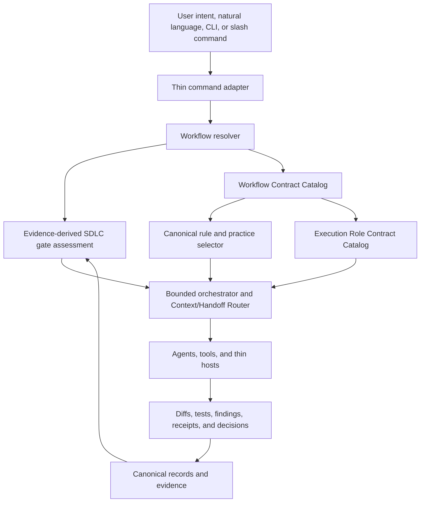

# Agentic SDLC Workflow Architecture

| Field | Value |
| --- | --- |
| Classification | Architecture design |
| Status | Proposed; records-only review; implementation authority withheld |
| Parent work | [Issue #179](https://github.com/hasanmanzak/meAndAI/issues/179) |
| Records review | Draft [PR #181](https://github.com/hasanmanzak/meAndAI/pull/181) |
| Lifecycle feature | [FEAT-0057](../../features/FEAT-0057-explicit-sdlc-backlog-governance/README.md) / [issue #150](https://github.com/hasanmanzak/meAndAI/issues/150) |
| Execution feature | [FEAT-0070](../../features/FEAT-0070-agentic-sdlc-workflow-capabilities/README.md) / [issue #180](https://github.com/hasanmanzak/meAndAI/issues/180) |
| Decisions | Proposed [DEC-0037](../../decisions/DEC-0037-explicit-sdlc-and-github-native-workflow-authority.md) and proposed [DEC-0038](../../decisions/DEC-0038-protocol-owned-workflow-contracts-and-bounded-agent-execution.md) |
| Originating idea | [IDEA-0001](../../ideas/IDEA-0001-role-based-multi-agent-protocol.md) |
| Delivery plan | [Successor delivery plan](delivery-plan.md) |
| Memory handoff | [2026-08-12 planning handoff](../../../.ai/memory/log/2026-08-12-agentic-sdlc-workflow-architecture.md) |

## 1. Outcome

meAndAI can expose requests such as `/develop`, `/review`, `/document`, and
future commands without making command files the semantic authority. A thin
adapter resolves an intent to a protocol-owned Workflow Contract, selects
applicable canonical rules and practices, assigns bounded execution roles,
packages minimum exact context, and returns evidence to the existing SDLC gate
assessment.

The proposed design incorporates the previously discussed multi-agent model
and the existing software-development lifecycle as one coherent architecture:

- the protocol owns rules, lifecycle, evidence, and grant boundaries;
- a workflow owns one reusable behavior contract;
- a command is an optional alias;
- a role bounds responsibility but grants nothing by itself;
- an agent is a temporary actor;
- an orchestrator routes and collects rather than inheriting mutation or
  release authority; and
- single-agent execution would remain the default if the proposal is accepted.

## 2. Relationship to current authorities

This architecture extends but does not replace:

- the [common development protocol](../../../PROTOCOL.md), including its
  existing Gate 0 through Gate 7 lifecycle;
- [DEC-0035](../../decisions/DEC-0035-protocol-owned-governance-and-execution-architecture.md),
  which makes the protocol platform the product and CLI/workflow/action/agent
  surfaces thin hosts;
- [DEC-0022](../../decisions/DEC-0022-release-declared-semantic-capabilities.md),
  whose semantic capability catalog must not be confused with workflow
  contracts;
- [DEC-0029](../../decisions/DEC-0029-canonical-recurrence-knowledge-and-test-harness-ownership.md),
  which requires canonical recurrence and executable evidence owners; and
- project instructions and project-local memory, which retain repository-local
  overlays without copying reusable protocol behavior into consumers.

The proposed names therefore are **Workflow Contract Catalog** and **Execution
Role Contract Catalog**. They do not create a second semantic capability,
compiled policy, or grant catalog.

The [successor delivery plan](delivery-plan.md#related-work-reconciliation)
also reconciles the durable work identities from the earlier SDLC/backlog
delivery packet. It resumes only
[FEAT-0057](../../features/FEAT-0057-explicit-sdlc-backlog-governance/README.md),
retains [BUG-0045](https://github.com/hasanmanzak/meAndAI/issues/149) /
[FEAT-0058](../../features/FEAT-0058-v0156-completed-historical-adoption-issues/README.md)
and [FIND-0120 / issue #44](https://github.com/hasanmanzak/meAndAI/issues/44)
as completed evidence, and leaves
[BUG-0036 / issue #139](https://github.com/hasanmanzak/meAndAI/issues/139)
under its own live issue and future authority. Thematic proximity to this
architecture neither reopens completed work nor silently absorbs a separate
defect.

## 3. Conceptual model

No arrow grants authority. Mutation and provider effects still require the
exact plan and non-transitive grants defined by
[DEC-0035](../../decisions/DEC-0035-protocol-owned-governance-and-execution-architecture.md).

## 4. Three separate state models

| State model | Purpose | What it cannot imply |
| --- | --- | --- |
| Product-work SDLC | Projects Gate 0 through Gate 7, backlog state, maintenance, and retirement | A gate transition without canonical evidence or explicit authority |
| Workflow run | `Requested -> Resolved -> Admitted -> Assigned -> Running -> Assessed -> Completed/Blocked/NeedsDecision` | Product completion, approval, merge, publication, or release |
| Protocol application | Existing adoption, update, publication, release, and authority-transfer state machines | General development progress or agent-role permission |

Readiness, implementation authorization, review, finding disposition, merge,
release publication, and operational state remain separate evidence axes under
proposed [DEC-0037](../../decisions/DEC-0037-explicit-sdlc-and-github-native-workflow-authority.md).

## 5. Workflow Contract Catalog

Each workflow definition must be independently inspectable and release-bound.
Its minimum contract is:

| Field | Meaning |
| --- | --- |
| Identity | Stable slug plus schema/revision and immutable release binding |
| Class | `Support`, `DiscoveryPlanning`, `Production`, `Assurance`, `Records`, `Delivery`, `ProtocolLifecycle`, or `Orchestration` |
| Purpose | Observable outcome and explicit non-goals |
| Admission | Required gate, readiness, exact base, authority, and recurrence conditions |
| Inputs and outputs | Typed request and handoff/result schemas |
| Effects | Read-only, repository write, provider write, publication, or release boundary |
| Authority | Exact real grants required; role names are insufficient |
| Directives | Canonical rule/practice references and applicability predicates |
| Participants | Eligible execution roles and single-writer ownership |
| Context | Minimum exact context recipe and mandatory rereads |
| Evidence | Required tests, findings, receipts, stop result, and gate-assessment input |
| Safety | Concurrency, idempotence, retry, recovery, expiry, budget, and escalation rules |
| Adapters | Zero or more command, natural-language, CLI, workflow, or service bindings |

Aliases and workflows are many-to-many. Renaming or adding an alias cannot
change workflow semantics. An unknown or ambiguous binding must not silently
select a mutating workflow.

## 6. Workflow families

The catalog is extensible; the following examples are deliberately not a
closed command list.

| Family | Example requests | SDLC relationship |
| --- | --- | --- |
| Support | inspect, search, explain, answer, status | Collects evidence; does not advance a gate |
| Discovery and planning | triage, clarify, shape, plan, design | Produces candidate Gate 0 through Gate 2 evidence |
| Production | develop, fix, refactor, migrate | Admitted only after required Gate 1 and Gate 2 evidence; works through Gate 3 and Gate 4 |
| Assurance | test, review, security, performance | Produces bounded Gate 3 through Gate 6 evidence; does not self-approve |
| Records | document, synchronize, handoff | Maintains traceability across all applicable gates |
| Delivery | prepare pull request, merge | Operates at Gate 7 under separate authority |
| Protocol lifecycle | adopt, update, recover, verify publication | Uses existing protocol application state machines and grants |
| Orchestration | decompose, dispatch, collect, assess | Coordinates other contracts; does not itself advance a gate |

Documentation has two meanings that must not be conflated. Every record-emitting
workflow selects documentation-graph rules as a cross-cutting directive. A
dedicated records workflow may additionally reconcile documentation as its own
outcome.

## 7. Rule, practice, overlay, skill, role, and task separation

Resolution proceeds from stronger authority to narrower context:

1. normative protocol rules and accepted decisions;
2. project instructions, project memory, and valid project decisions;
3. the selected Workflow Contract and its canonical directive references;
4. applicable practice and tool skills;
5. role assignment and exact grant envelope; and
6. the task request, slice, include/exclude scope, and validation budget.

A lower layer may narrow behavior but cannot broaden authority or silently
override a higher layer. A project deviation from a common default requires the
existing numbered-decision route.

DDD, Rich Entity Model, TDD, and SOLID remain engineering defaults in the
[protocol](../../../PROTOCOL.md#2-engineering-defaults). Domain-oriented
development selects the applicable subset. A documentation-only or
infrastructure-only task records non-applicability rather than pretending to
use an entity model. Review and tests resolve the same referenced practices;
they do not maintain copied reviewer/tester versions.

Skills explain how an actor can perform a technique or use a tool. They do not
define normative acceptance, authorize mutation, or advance the lifecycle.

## 8. Execution roles and real authority

| Role | Responsibility | Default effect boundary |
| --- | --- | --- |
| Analyst/Planner | Inspect, decompose, model, and propose | Read-only |
| Writer/Developer | Change only an assigned coherent slice | Assigned repository paths under an explicit task authority |
| Reviewer | Produce independent evidence and findings | Read-only; cannot approve its own findings |
| Tester | Design or execute verification | Read-only unless it temporarily owns a distinct test-writing slice |
| Documenter | Maintain assigned records and links | Assigned documentation paths only |
| Delivery actor | Apply an exact provider or release plan | No default authority; exact grant required |
| Orchestrator | Resolve, assign, collect, and assess | Coordination only; no inherited write, merge, or release grant |

Actor identity, role assignment, and real grant are three different values.
Role assignment can only reduce the effect surface allowed by a real grant.

## 9. Activation and concurrency

### Proposed first-release defaults

- One agent handles ordinary work.
- A team has at most one orchestrator and two active workers.
- At most one writer owns a slice; the first release permits no parallel
  writers even on apparently disjoint slices.
- Read-heavy analyst, reviewer, and verifier lanes may run concurrently when
  their scopes and evidence owners are disjoint.
- A worker cannot spawn another worker. Recursive delegation has no first-
  release override.
- The writer still performs required self-review. An independent reviewer adds
  evidence; it does not replace the protocol review gate.

### Activation signals

Multi-agent execution may activate only when at least one is true:

- two or more independently reviewable and verifiable slices exist;
- an independent read-only assurance lane materially reduces risk; or
- a large evidence inventory can be partitioned without shared ownership.

It remains disabled for small changes, incomplete Definition of Ready,
ambiguous scope, multiple applicable recurrence entries, overlapping write
sets, missing owner or acceptance criteria, missing validation budget, or
absent mutation/provider authority.

## 10. Context and handoff contract

### Outbound envelope

- workflow identity and exact repository base;
- stable work links, current gate, and requested outcome;
- included and excluded scope plus writable paths;
- role assignment and actual read/write/provider authority;
- canonical rule/practice and project-overlay references;
- applicable recurrence entries with required safe response and unsafe retry
  boundary;
- dependencies, acceptance criteria, test links, and validation budget;
- expected output/evidence schema, stop conditions, expiry, and escalation
  route.

### Return envelope

- `Completed`, `Blocked`, or `NeedsDecision`;
- changed paths or generated artifact identities;
- commands and retained results, or the explicit not-run rationale;
- findings with exactly one protocol disposition;
- assumptions, open questions, and residual risks;
- recommended next gate assessment; and
- exact base/head consistency and stale-state result.

Stale base, ambiguous recurrence, missing authority, expired context, or a
conflicting writer lease fails closed. The envelope is minimum exact context,
not a replacement for mandatory repository-instruction and recurrence reads.

## 11. DRN prior-art disposition

The analysis uses exact public source at DRN commit
[`0f74ade879c2285a2a4ac19350edd95015dd03fd`](https://github.com/duranserkan/DRN-Project/commit/0f74ade879c2285a2a4ac19350edd95015dd03fd).

| DRN pattern | meAndAI disposition |
| --- | --- |
| Focused startup and minimum-context routing in the [operating model](https://github.com/duranserkan/DRN-Project/blob/0f74ade879c2285a2a4ac19350edd95015dd03fd/.agent/workflows/_shared/workflow-operating-model.md) | Adopt the principle through exact context recipes and mandatory source rereads |
| Extensible route selection in the [goal workflow](https://github.com/duranserkan/DRN-Project/blob/0f74ade879c2285a2a4ac19350edd95015dd03fd/.agent/workflows/goal.md) | Adopt commands as thin aliases and keep an open workflow catalog |
| Shared lifecycle and handoff status in the [status model](https://github.com/duranserkan/DRN-Project/blob/0f74ade879c2285a2a4ac19350edd95015dd03fd/.agent/workflows/_shared/status-lifecycle.md) | Adopt explicit workflow-run state, but keep it separate from product gates and protocol applications |
| Task-scoped skills in the [skill index](https://github.com/duranserkan/DRN-Project/blob/0f74ade879c2285a2a4ac19350edd95015dd03fd/.agent/skills/overview-skill-index/SKILL.md) | Adopt focused selection; skills remain non-normative techniques |
| Rich domain guidance in the [domain skill](https://github.com/duranserkan/DRN-Project/blob/0f74ade879c2285a2a4ac19350edd95015dd03fd/.agent/skills/drn-domain-design/SKILL.md) | Adopt applicability-based domain practice selection, not DRN-specific entity/framework rules |
| Read-only review in the [review workflow](https://github.com/duranserkan/DRN-Project/blob/0f74ade879c2285a2a4ac19350edd95015dd03fd/.agent/workflows/review.md) | Adopt evidence independence and non-mutating reviewer authority |
| Mandatory CAD artifacts, long persona combinations, routine hash approval envelopes, and repeated command-local rules | Do not adopt as common defaults; use existing meAndAI gates, bounded evidence, and canonical references |

## 12. Accepted conclusions and open decisions

### Conclusions inherited from current authority

- The protocol, not the command or agent, is canonical.
- Gate 0 through Gate 7 remains the product delivery lifecycle.
- Roles do not create grants; evidence rather than claims advances gates.
- Reusable definitions remain upstream-owned and pinned for consumers.
- Documentation rules and engineering practices are selected by applicability
  and referenced rather than copied.

### Proposed choices requiring maintainer acceptance

- workflow identity format and release-envelope binding;
- the exact lifecycle vocabulary in proposed
  [DEC-0037](../../decisions/DEC-0037-explicit-sdlc-and-github-native-workflow-authority.md);
- the first pilot: read-only gate assessment or records synchronization;
- single-agent execution as the default, singular writer ownership, the
  one-orchestrator/two-worker ceiling, and first-release bans on all parallel
  writers and recursive delegation;
- when an independent actor review is mandatory;
- deterministic versus reviewed-semantic practice applicability;
- durable workflow-run state ownership and candidate non-authority;
- natural-language ambiguity thresholds;
- exact predecessor features, target versions, and validation budgets.

## 13. Authorization freeze

This architecture records analysis, decisions, risks, tests, and delivery
options only. It changes no protocol behavior, production code, executable
test, workflow, capability, agent prompt, issue form, label, consumer,
provider state, merge rule, release, or authority transfer. The
[successor delivery plan](delivery-plan.md) and each feature's incomplete
Definition of Ready must close before a later explicit directive can authorize
one bounded implementation slice.
