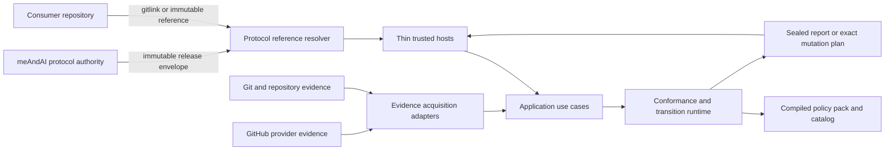
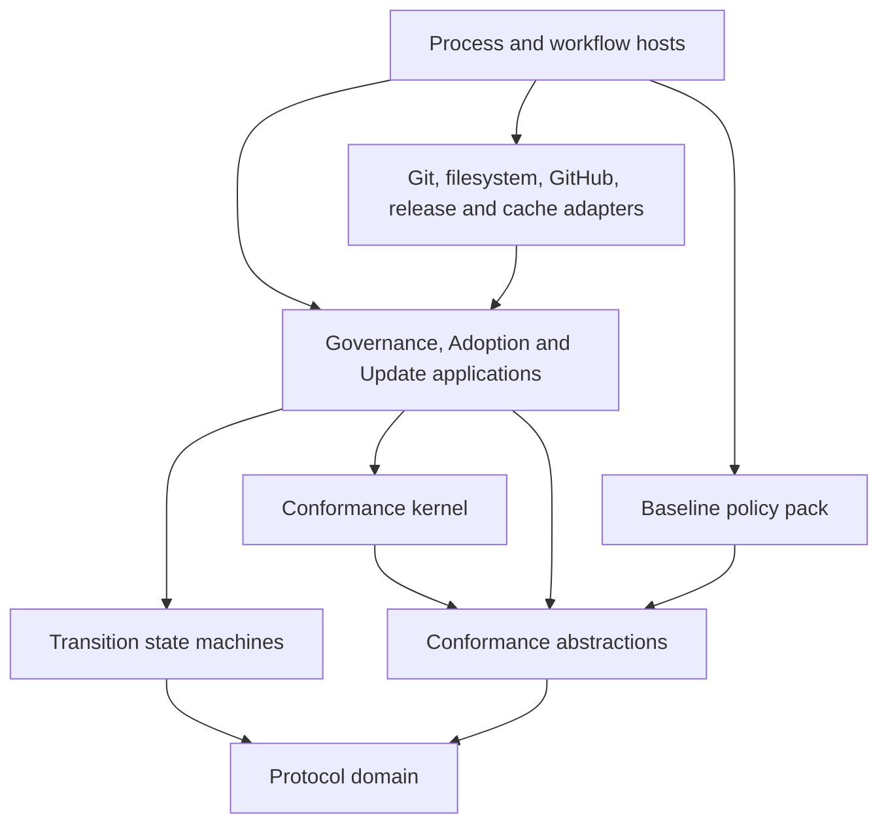
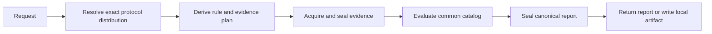

# Protocol Governance and Execution Architecture

| Field | Value |
| --- | --- |
| Classification | Architecture design |
| Status | Accepted; [SUBF-0152](../../features/FEAT-0065-shared-executable-conformance-runtime/README.md#subf-0152) and [SUBF-0153](../../features/FEAT-0065-shared-executable-conformance-runtime/README.md#subf-0153) complete; [SUBF-0143](../../features/FEAT-0065-shared-executable-conformance-runtime/README.md#subf-0143) Gate 2 and historical `13/13` A baseline accepted; bounded `FIND-0441` grammar/number/graph/rule recovery is `ReviewedLocalGreen` with focused `1/1`, cumulative `17/17`, and fresh review `0/0/0`; exact staged-tree/checkpoint remains pending and unauthorized, and [TEST-0210](../../features/FEAT-0065-shared-executable-conformance-runtime/test-cases.md#test-0210) remains `Planned` |
| Owning epic | [EPIC-0002 / issue #163](https://github.com/hasanmanzak/meAndAI/issues/163) |
| Owning task | [TASK-0003 / issue #164](https://github.com/hasanmanzak/meAndAI/issues/164) |
| Decision | [DEC-0035](../../decisions/DEC-0035-protocol-owned-governance-and-execution-architecture.md) |
| Red-team review | [Closed at design level](red-team-review.md) |
| Successor allocation | [Successor delivery and qualification plan](successor-delivery-plan.md) |
| Preserved WIP disposition | [Exact extraction ledger](wip-extraction-ledger.md) |
| Accepted Gate-2 baseline | Exact-main typed-handoff predecessor [`23d27478af09446363bcb299dee24957e3a206a7`](https://github.com/hasanmanzak/meAndAI/commit/23d27478af09446363bcb299dee24957e3a206a7) |
| Current A implementation boundary | Historical `13/13` content `5fa7f7d`, BASE record sync `9107a49`; exact pushed [`7f60e0c66a49056b9e9854ccc353acfe67f65ed5`](https://github.com/hasanmanzak/meAndAI/commit/7f60e0c66a49056b9e9854ccc353acfe67f65ed5) is recovery input and not an accepted predecessor |
| Preserved implementation input | [`1873c98638ba4960734aadb188eb8c8d70b4bc52`](https://github.com/hasanmanzak/meAndAI/commit/1873c98638ba4960734aadb188eb8c8d70b4bc52) on [draft PR #160](https://github.com/hasanmanzak/meAndAI/pull/160) |
| Current authority | The corrected [ContractSlice A directive](https://github.com/hasanmanzak/meAndAI/issues/165#issuecomment-5139269228) plus bounded [FIND-0441](../../features/FEAT-0065-shared-executable-conformance-runtime/README.md#find-0441) recovery authorizes only correction, verification, review, and record synchronization of the already-pushed grammar/number/graph/rule candidate; no successor A, B/C/D, workflow/scenario-owner/[TEST-0146](../../features/FEAT-0035-test-runtime-efficiency/test-cases.md#test-0146), WIP, consumer, release, publication, authority-transfer, PowerShell-retirement, or Git checkpoint authority is granted |

## 1. Outcome

meAndAI is a versioned protocol platform, not a collection of CLI products.
It owns all of the following as one coherent release authority:

- normative protocol specifications;
- a shared executable conformance pack;
- qualification fixtures and regression evidence for that pack;
- adoption and update application services;
- release-declared migrations and managed projections; and
- thin process, workflow, and provider adapters that invoke those services.

A consumer supplies its own repository and provider evidence to the same pinned
conformance implementation used by meAndAI. It does not copy, translate,
reimplement, or locally retest protocol-owned rules, parsers, validators,
fixtures, workflows, or transition logic.

The executable implementation language is C#. Command-line syntax is only one
host adapter and does not define product, domain, policy, rule, application, or
release boundaries.

## 2. Architecture freeze

This record and [DEC-0035](../../decisions/DEC-0035-protocol-owned-governance-and-execution-architecture.md)
are accepted. Architecture acceptance itself authorized planning records only.
The later [implementation directive](https://github.com/hasanmanzak/meAndAI/issues/165#issuecomment-5122419932)
and [infrastructure clarification](https://github.com/hasanmanzak/meAndAI/issues/165#issuecomment-5122634847)
authorized one bounded implementation. [PR #170](https://github.com/hasanmanzak/meAndAI/pull/170)
merged it at exact main
[`c31819487e77fc878fc40fae6445bfef582719da`](https://github.com/hasanmanzak/meAndAI/commit/c31819487e77fc878fc40fae6445bfef582719da),
and [run 30511073506](https://github.com/hasanmanzak/meAndAI/actions/runs/30511073506)
passed both stable jobs.

The historical
[SUBF-0153](../../features/FEAT-0065-shared-executable-conformance-runtime/README.md#subf-0153)
[design-only directive](https://github.com/hasanmanzak/meAndAI/issues/165#issuecomment-5126219253)
produced the accepted evidence contract. [PR #171](https://github.com/hasanmanzak/meAndAI/pull/171)
merged it at exact main
[`cae8854f8afee4c31e362a02637b27b488aab90f`](https://github.com/hasanmanzak/meAndAI/commit/cae8854f8afee4c31e362a02637b27b488aab90f),
with bounded [closure evidence](https://github.com/hasanmanzak/meAndAI/pull/171#issuecomment-5128021520).

The later
[SUBF-0143](../../features/FEAT-0065-shared-executable-conformance-runtime/README.md#subf-0143)
[design-only directive](https://github.com/hasanmanzak/meAndAI/issues/165#issuecomment-5128172584)
authorized only Gate 1/2 design and expected-red planning for
[SUBF-0143](../../features/FEAT-0065-shared-executable-conformance-runtime/README.md#subf-0143)
and [TEST-0210](../../features/FEAT-0065-shared-executable-conformance-runtime/test-cases.md#test-0210).
That packet was accepted, merged, and bounded exact-main validated at
[`23d27478af09446363bcb299dee24957e3a206a7`](https://github.com/hasanmanzak/meAndAI/commit/23d27478af09446363bcb299dee24957e3a206a7),
satisfying the typed-handoff prerequisite for
[SUBF-0153](../../features/FEAT-0065-shared-executable-conformance-runtime/README.md#subf-0153)
without granting [SUBF-0143](../../features/FEAT-0065-shared-executable-conformance-runtime/README.md#subf-0143)
Gate 3.

The subsequent scoped
[activation directive](https://github.com/hasanmanzak/meAndAI/issues/165#issuecomment-5135051435)
authorized exactly [SUBF-0153](../../features/FEAT-0065-shared-executable-conformance-runtime/README.md#subf-0153)/
[TEST-0221](../../features/FEAT-0065-shared-executable-conformance-runtime/test-cases.md#test-0221)
Gate 3, its bounded predecessor inventory transition, scenario activation,
existing stable-job combined filter, and narrow
[TEST-0146](../../features/FEAT-0035-test-runtime-efficiency/test-cases.md#test-0146)
transition. That packet completed through [PR #173](https://github.com/hasanmanzak/meAndAI/pull/173)
at exact main
[`ff0f4f17ea65a9774f42b4c9ce660eeaa213b7fd`](https://github.com/hasanmanzak/meAndAI/commit/ff0f4f17ea65a9774f42b4c9ce660eeaa213b7fd),
and [run 30603364256](https://github.com/hasanmanzak/meAndAI/actions/runs/30603364256)
passed both stable jobs.

The later corrected
[ContractSlice A directive](https://github.com/hasanmanzak/meAndAI/issues/165#issuecomment-5139269228)
activates only reviewed [SUBF-0143](../../features/FEAT-0065-shared-executable-conformance-runtime/README.md#subf-0143)
ContractSlice A expected-red/green increments. A owns canonical manifest
parse/digest/typed projection and declaration/artifact/component preflight; it
constructs no executable export and declares no kernel. First executable
activation and six-list registration mismatch ownership remain in ContractSlice
C. The first limited ParseCanonical and second canonical quoted UTF-8 string
increments are green; the latter closes its coverage `Important` while
[TEST-0210](../../features/FEAT-0065-shared-executable-conformance-runtime/test-cases.md#test-0210)
remains `Planned`. Remaining A is held until a separately reviewed increment is
activated.

Outside that exact A boundary, the following remain prohibited:

- any later ContractSlice A production or test implementation before separate
  review and activation;
- ContractSlice B, C, or D production or test implementation;
- moving code from the preserved draft into the target branch;
- workflow, scenario-owner, [TEST-0146](../../features/FEAT-0035-test-runtime-efficiency/test-cases.md#test-0146),
  ruleset, or required-check activation;
- consumer-repository or provider mutation;
- release publication or protocol-authority transfer; and
- PowerShell compatibility or source retirement.

The original architecture packet used a no-run route and left the workflow
unchanged. [PR #169](https://github.com/hasanmanzak/meAndAI/pull/169) merged it at
[`a2be672b91cb41b88597c5123a0d5b0e9a54d34e`](https://github.com/hasanmanzak/meAndAI/commit/a2be672b91cb41b88597c5123a0d5b0e9a54d34e),
whose exact tree passed [main run 30483054367](https://github.com/hasanmanzak/meAndAI/actions/runs/30483054367).
Completed
[SUBF-0152](../../features/FEAT-0065-shared-executable-conformance-runtime/README.md#subf-0152)
and [SUBF-0153](../../features/FEAT-0065-shared-executable-conformance-runtime/README.md#subf-0153)
have passed and closed their applicable implementation-entry and publication
prerequisites. The corrected A directive is the only active successor
implementation boundary; the architecture freeze remains in force elsewhere.

Outside the scoped directive, allowed work remains limited to architecture
decisions, diagrams, terminology, record-transition maps, red-team review, and
design acceptance scenarios. Production/test code, catalog activation, package
activation, workflow enforcement, cherry-picking or merging
[PR #160](https://github.com/hasanmanzak/meAndAI/pull/160),
consumer/provider mutation,
release work, and authority transfer are outside the freeze boundary.

## 3. Scope and non-goals

### 3.1 In scope

- repository files, file structure, document content, and Git identity;
- issues, pull requests, conversation comments, review bodies, inline review
  comments, workflow metadata, and release metadata;
- shared rule identity, applicability, evidence, findings, qualification, and
  reporting;
- meAndAI self-consumption and arbitrary project-neutral consumers;
- fresh adoption, existing-repository adaptation, protocol update, recovery,
  publication, and finalization boundaries;
- immutable protocol references and exact release distribution; and
- local, CI, event-driven, scheduled, and captured-evidence execution.

### 3.2 Non-goals

- making CLI arguments a stable domain API;
- executing consumer-provided code inside a privileged governance process;
- inferring project-specific semantics from arbitrary prose;
- allowing a consumer to weaken or shadow the protocol baseline;
- treating a partial provider scan as conforming;
- auto-correcting governance findings;
- making PowerShell the source specification for C#; or
- merging the preserved [FEAT-0060](../../features/FEAT-0060-any-consumer-governance-cli/README.md)
  branch wholesale.

## 4. The four meanings currently hidden by test

The architecture separates four concepts that were previously easy to
conflate:

| Concept | Owner | Purpose | Consumer treatment |
| --- | --- | --- | --- |
| Normative requirement | meAndAI protocol records | States what must be true | Referenced through the pinned protocol |
| Executable conformance rule | meAndAI C# conformance pack | Evaluates typed target evidence | Executed unchanged |
| Qualification scenario and fixture | meAndAI test suite | Proves the evaluator and adapters | Not copied or rerun as consumer-owned tests |
| Consumer domain test | Consumer | Proves project-specific product behavior | Authored and maintained locally |

Running a common rule against consumer evidence is not “retesting the
validator.” The upstream qualification suite proves the validator; the
consumer execution determines whether that consumer conforms.

For example, clickable-reference governance is one semantic rule family used
across documents, issue bodies, pull-request bodies, comments, and reviews.
The rule does not become a different implementation for every surface. Typed
evidence adapters change; the semantic evaluator remains common. Provider
pagination/completeness and post-publication orchestration are separately
qualified contracts.

## 5. Non-negotiable invariants

1. **One common owner.** A protocol rule, parser, fixture family, report schema,
   managed projection, or transition implementation has one upstream owner.
2. **Same executable baseline.** meAndAI and consumers use the same compiled
   baseline rules. Role-specific applicability does not create copied catalogs.
3. **Evidence before verdict.** Missing, stale, partial, or failed required
   evidence cannot produce `Conforming`.
4. **Rules do not perform I/O.** Evaluation consumes sealed typed evidence and
   cannot read files, Git, network, environment variables, clocks, or tokens.
5. **Governance evaluation is read-only.** Its process has no repository or
   provider write adapter. Publishing an exact sealed result is a separate,
   narrowly granted application and process.
6. **Mutation is planned and granted.** Adoption and update mutate only an
   exact reviewed plan under an explicit capability grant.
7. **One mutating engine.** PowerShell and C# never apply or publish the same
   operation; failure never triggers automatic cross-engine fallback.
8. **Exact immutable pairing.** Protocol source, policy catalog, evaluator
   pack, schemas, hosts, and projections are bound by one release envelope.
9. **Candidate cannot self-authorize.** The last trusted immutable runtime and
   independent qualification evidence gate the next runtime.
10. **Hosts stay thin.** CLI, workflow, action, agent, or future service hosts
    compose use cases and translate transport/process concerns only.
11. **No silent weakening.** A caller cannot disable baseline rules, lower
    severity, reduce authoritative evidence scope, or reinterpret acquisition
    failure as success.
12. **Deterministic public evidence.** Canonical reports are ordered, redacted,
    machine-readable, digest-bound, and free of machine-specific paths.

## 6. System context



The consumer reference chooses an immutable protocol release. The target
repository remains the evidence subject; it does not become a source of common
runtime code.

## 7. Logical components and dependency direction



All arrows point inward. The target C# project boundaries are:

| Logical project | Responsibility | Allowed dependencies |
| --- | --- | --- |
| `MeAndAI.Protocol.Domain` | Identities, profile/outcome tokens, evidence-requirement values, and structural acquisition/evidence carriers | BCL only |
| `MeAndAI.Protocol.Conformance.Abstractions` | Rule/catalog/schema declarations, finalized-manifest bindings, provider-neutral capabilities, evaluator inputs/intents, and proof-candidate seams over Domain values | Domain |
| `MeAndAI.Protocol.Conformance` | Manifest/catalog activation, admission, two-phase planning, typed-model/index caches, sealed qualified references, kernel-minted findings/evaluations, and outcome aggregation | Domain and abstractions |
| `MeAndAI.Protocol.Policy` | Exact compiled codecs/models/indexers/evaluators plus logical qualification or complete-policy exports; final artifact digests remain in the external finalized manifest | Domain and abstractions |
| `MeAndAI.Protocol.Transitions` | Pure adoption/update transition and plan invariants | Domain |
| `MeAndAI.Protocol.Application` | Governance evaluation, report publication, adoption, update, and protocol release-finalization use cases and I/O ports | Domain, conformance, transitions |
| `MeAndAI.Protocol.Infrastructure.*` | Git, filesystem, GitHub, release, cache, clock, process, and report-publisher port implementations | Application and inward contracts |
| `MeAndAI.Protocol.*.Host` | Composition roots and process/transport mapping | Required application, policy, and least-authority adapters |

Existing `MeAndAI.Operations.*` assets are inputs to this map. Project and
namespace migration is successor delivery work; no existing assembly is
assumed to satisfy a target component merely because its name is similar.

## 8. C# implementation boundary

All new executable protocol behavior is implemented in C#, including:

- domain and semantic types;
- rule evaluators and catalogs;
- parsers and typed indexes;
- evidence acquisition and normalization;
- conformance and report construction;
- adoption/update assessment, planning, application, recovery, and closure;
- protocol release planning, publication, verification, and authority transfer;
- complete post-start package/reference/release verification; and
- provider orchestration logic.

Markdown, JSON, YAML, and workflow files may declare specifications,
metadata, schemas, mappings, and composition. The only pre-C# exception is the
minimal **Trust Bootstrap** required to decide whether downloaded C# may be
started. It may use a provider/native cryptographic trust primitive to:

1. accept an exact bootstrap reference from protected base configuration or an
   explicitly identified local maintainer authority;
2. verify the release attestation against the accepted issuer, protocol
   repository, workflow/builder identity, source ref and commit, predicate
   schema, asset subject name, and SHA-256 digest declared by that reference;
3. verify the exact declared .NET runtime identity; and
4. start only that digest-matched C# host.

For an already adopted repository, the bootstrap reference is derived from the
trusted base's immutable protocol reference. For first adoption it is an
`AdoptionBootstrapReference` containing the trusted protocol repository
identity, exact target tag and source commit, named asset, accepted attestation
identity/schema, expected asset digest, and declared runtime. It is supplied by
protected automation or an explicitly authenticated local maintainer; it can
never mean `latest`, a branch tip, or an ambient checkout.

The Trust Bootstrap cannot parse governed content, select rules or migrations,
interpret repository state, retry a transition, construct a report or plan,
or make a mutation/verdict decision. Immediately after launch, C# independently
re-verifies the complete reference, release, manifest, attestation, package,
policy, schema, and runtime chain before any protocol use case may proceed.

The Trust Bootstrap never installs a runtime or executes a setup action. The
declared .NET runtime is an externally provisioned platform precondition and
must already match exactly; absence or mismatch returns `RuntimeUnavailable`
and stops before protocol code executes. Bringing runtime installation into the
bootstrap TCB requires a later architecture decision and an independently
attested installer trust chain.

Portable framework-dependent JIT distribution remains the default from
[DEC-0032](../../decisions/DEC-0032-csharp-operational-applications-and-portable-jit-distribution.md).
The exact supported SDK/runtime version is release configuration, not a second
implementation language or architecture variant.

## 9. Rule and catalog model

### 9.1 Stable identities

Executable conformance rules receive a new `RULE-NNNN` identity class after
architecture approval. A rule identity is distinct from:

- the exact normative document link that authorizes it;
- one or more `TEST-NNNN` qualification scenarios;
- a finding code emitted by it; and
- an execution profile that selects it.

`RULE-NNNN` values are repository-local, monotonic, immutable, and never
reused. Existing `TEST-NNNN` identities remain historical and are mapped, not
renamed. The accepted successor matrix allocates RULE-0001 through RULE-0005
as the first prospective identities; that allocation grants no implementation,
catalog-revision, normative-fragment-digest, or evaluator authority.

### 9.2 Rule descriptor

Every baseline rule declares:

- rule ID, rule revision, and catalog version;
- exact normative specification path, anchor, containing Git blob provenance,
  canonicalization schema, and canonical per-rule normative-fragment digest;
- qualification scenario links;
- evaluator key and implementation digest binding;
- required evidence kinds and completeness requirements;
- applicable subject roles, surfaces, snapshot kinds, and operations;
- severity, enforcement capability, and whether waiver is permitted;
- introduction, deprecation, and retirement protocol versions;
- deterministic finding codes and remediation links; and
- compatibility aliases for migrated legacy evidence where required.

The containing blob proves provenance but is not the rule's semantic revision
identity. `RuleRevision` changes when the canonical normative fragment, the
semantic applicability/evidence/finding/waiver/enforcement contract, or any
qualification-observable expected outcome changes. A behavior-changing defect
fix is therefore a reviewed `Revised` rule even when its normative prose is
unchanged, and links the defect plus changed qualification evidence. An
unrelated edit elsewhere in the containing document does not revise the rule.
A separately recorded `EvaluatorArtifactRevision` and digest may change without
a rule revision only when same-evidence differential qualification proves no
expected semantic outcome changed.

Every protocol release contains a complete immutable catalog snapshot. Its
transition from the previous catalog classifies each rule as `Unchanged`,
`Added`, `Revised`, or `Retired` and links every non-unchanged entry to its
reviewed rule-change authority. That authority is either a normative change or,
for unchanged prose with changed expected outcomes, a defect record plus exact
qualification/differential evidence. No semantic-version range infers rule
compatibility.

A bounded qualification slice may declare a smaller exact fixture inventory,
but it is not a protocol release catalog. It has no authoritative named profile
and cannot mint a complete-baseline `ConformanceVerdict`. Qualification-slice
and complete-snapshot declarations, compiled exports, kernels, and results are
non-interchangeable; relabeling a partial slice as complete fails activation.

### 9.3 Compiled policy pack

The release contains both:

1. a machine-readable catalog manifest; and
2. compiled C# evaluator implementations.

The manifest is metadata, not an interpreted general-purpose rule language.
Its evaluator, codec, model, and index keys must resolve to explicit compiled
implementations in the exact release-bound policy export. This keeps catalogs
inspectable while preventing arbitrary consumer or provider content from
becoming executable code.

Binding is acyclic: compiled artifacts contain logical keys only; a separate
finalized manifest binds their exact artifact digests; the release envelope
then binds that manifest and the artifacts. No artifact contains its own final
digest and the canonical manifest bytes do not contain their own digest.
Activation uses an already trusted release-loader proof that the loaded export
came from those exact artifact bytes. Assembly names, MVIDs, self-asserted
digests, reflection discovery, DI registration, and consumer implementations
do not confer authority.

The normative record remains the authority. The catalog references its exact
source blob/anchor for provenance and digests the canonical rule fragment; it
must not introduce independent normative prose.
The evaluator is a qualified executable interpretation; neither catalog nor
code may silently override the referenced specification.

### 9.4 Parse and acquire once

Acquisition first produces schema-identified payload bytes asserted canonical
by an untrusted carrier, typed locations, and content-addressed structural
bindings.
[FEAT-0067](../../features/FEAT-0067-evidence-acquisition-managed-consumer-integration/README.md)
qualifies that carrier against the exact release schema,
source contract, provenance, resource limits, and payload/location coherence.
The protocol-owned kernel then constructs one sealed evaluation context.
Release/schema/content/artifact-bound decode/parse attempts and their typed
failures are cached separately from context/location/root-reference/index-
artifact-bound index attempts and failures. Distinct rules reuse those
immutable typed models while retaining distinct invariants and findings.
Canonical semantic limits are deterministic byte, depth, count, and complexity
budgets. Host wall-clock timeout or cancellation is an operational runtime
failure, never a memoized semantic parse/evidence result.

The evaluator-facing boundary is generic and model-typed. It exposes no
`object`, `dynamic`, raw provider DTO/JSON node, service-provider lookup,
reflection scan, or consumer executable registration. Decoder/evaluator
activation resolves only from the exact immutable release catalog, including
assembly, type, schema, parser version, and artifact digest. A universal parser
is not required; a second same-contract parser is prohibited.

## 10. Evidence and location model

### 10.1 Evidence kinds

The domain supports at least:

- exact Git tree, blob, commit, ref, diff, and history evidence;
- candidate HEAD/index/worktree/untracked evidence;
- repository file and file-system topology evidence;
- parsed Markdown, identifier, link, anchor, schema, and instruction-graph
  evidence;
- protocol reference, version, release, capability, migration, and projection
  evidence;
- GitHub issue, pull request, issue comment, review, review comment, workflow,
  run, release, tag, branch, and asset evidence; and
- captured immutable evidence envelopes for replay and differential review.

### 10.2 Typed locations

A finding location is a discriminated value, never merely a path string:

- repository path plus blob/commit, line, anchor, or property;
- provider/repository plus object type, stable object ID, version identity,
  field, and optional line/fragment;
- release asset plus release/tag and digest; or
- snapshot/run-level location where no narrower location exists.

### 10.3 Acquisition context and result union

The post-routing request names an exact subject/source target, surface,
snapshot kind, adapter contract, source API/schema contract, and rule-declared
evidence requirements. One source-contract identity denotes one endpoint and
cursor grammar; independent endpoints use distinct requests/results. The
observed acquisition context then contains:

- the requested target and exact observed boundary as one EvidenceScope;
- schema-identified content asserted canonical but not yet qualified, content
  digests, typed locations, and structural bindings;
- one requirement-scoped consistency/redaction/failure state per request;
- page/cursor observations and source-object counts, distinct from schema
  projection/binding counts;
- acquisition interval and provider convergence/boundary identity;
- context-minted structural root evidence references for binding members; and
- caller-independent Complete or Incomplete status.

A structurally Complete zero-binding context carries an empty-inventory
assertion but no member reference. After
[FEAT-0067](../../features/FEAT-0067-evidence-acquisition-managed-consumer-integration/README.md)
qualification, the sealed
evaluation context alone mints a qualified context-proof reference for
absence/coverage findings. Raw Domain root references are not independently
finding authority.

The closed acquisition result has three variants. Observed carries a valid
Complete/Incomplete context. Absent records that no attempt/input was supplied
and is Incomplete. Failed records an attempted required source that produced no
valid context, carries requirement-scoped failures, and is Failed. There is no
valid “failure envelope.”

Admission to the sealed kernel is variant-specific. Observed requires an exact
[FEAT-0067](../../features/FEAT-0067-evidence-acquisition-managed-consumer-integration/README.md)
manifest-bound post-codec qualification proof candidate which Conformance
validates before minting its internal receipt; the codec is not rerun. Failed
requires an exact request/attempt/failure proof proving that no valid partial
context exists; Absent is
kernel-synthesized only from a catalog-declared expected request slot plus a
no-input/no-attempt routing receipt. A caller-authored Absent value or a raw
public Domain result never becomes sealed authority.

Raw cursors, ETags, provider DTOs, credentials, response bodies, and exception
text are never public Domain values. Adapters hash or normalize them into
schema-identified structural carriers; exact release-bound
[FEAT-0067](../../features/FEAT-0067-evidence-acquisition-managed-consumer-integration/README.md)
qualification must succeed before the kernel can seal them for evaluation.

Rules never call adapters. The application aggregates rule requirements,
acquires each shared source once, constructs the exact context/result values,
and supplies proof candidates; the Conformance kernel alone admits them,
builds the sealed typed-model context, and evaluates. The exact
BCL-only acquisition value contract, invalid-state matrix, typed-location
family, typed-kernel handoff, and
[TEST-0221](../../features/FEAT-0065-shared-executable-conformance-runtime/test-cases.md#test-0221)
plan are defined by the accepted/merged/exact-main
[evidence-acquisition design](../../features/FEAT-0065-shared-executable-conformance-runtime/subf-0153-evidence-contract-design.md).
That accepted design did not itself authorize implementation. Its exact
catalog/admission/evaluation seam was closed prospectively by the separately
reviewed and now accepted/merged/bounded exact-main
[SUBF-0143](../../features/FEAT-0065-shared-executable-conformance-runtime/README.md#subf-0143)
[typed-evaluation-kernel design](../../features/FEAT-0065-shared-executable-conformance-runtime/subf-0143-typed-evaluation-kernel-design.md).
The scoped [activation directive](https://github.com/hasanmanzak/meAndAI/issues/165#issuecomment-5135051435)
now authorizes only the bounded [SUBF-0153](../../features/FEAT-0065-shared-executable-conformance-runtime/README.md#subf-0153)
Gate 3 implementation over that seam.
[FEAT-0067](../../features/FEAT-0067-evidence-acquisition-managed-consumer-integration/README.md)
owns I/O,
normalization, source-schema qualification, pagination, and convergence;
Domain derives ContentDigest and immutable structural binding/context values;
[SUBF-0143](../../features/FEAT-0065-shared-executable-conformance-runtime/README.md#subf-0143)
owns typed decoding, sealed context/root/derived references,
applicability, findings, and evaluation.

## 11. Snapshot authority

| Snapshot kind | Purpose | Authority |
| --- | --- | --- |
| `ExactCommit` | Clean local/CI/release evaluation of exact Git objects | Eligible for merge/release evidence |
| `Candidate` | HEAD, index, worktree, and untracked developer feedback | Explicitly non-authoritative |
| `ProviderEvent` | One delivery plus current related provider state | Event-scoped evidence only |
| `ProviderFullInventory` | Bounded-convergent inventory of all required provider objects | Eligible for inventory evidence when complete |
| `CapturedEvidence` | Immutable replay/differential input | Authority inherited from capture manifest |

A dirty or staged candidate report records HEAD plus index, worktree, and
untracked digests. It may guide development but cannot authorize merge,
release, migration, or authority transfer.

## 12. Profile, applicability, and enforcement

An execution profile is a typed product of independent semantic axes, not a single
`authority` or `consumer` string:

- `SubjectRole`: `ProtocolAuthoritySelfConsumer` or `Consumer`;
- `Operation`: conformance, adoption assessment/plan/apply, update
  assessment/plan/apply, publication, finalization, or recovery;
- `SnapshotKind`: one value from [Section 11](#11-snapshot-authority);
- `SurfaceSet`: repository, provider surface families, workflow, or release;
- `EnforcementPhase`: audit, prospective, or full blocking.

Authoritative named profiles are immutable release declarations. A caller may
request additional diagnostic rules or a smaller non-authoritative local scan,
but it cannot narrow an authoritative profile, disable baseline rules, reduce
required evidence, or lower enforcement. Semantic applicability is computed by
the catalog from the subject, operation, snapshot, surface, and sealed subject
facts—not from adapter availability or permissions. Adapter/evidence capability
is a separate acquisition-planning contract. If an applicable rule's required
capability/evidence is unavailable, the rule is `NotEvaluated` and conformance
is `Indeterminate`; it never becomes `NotApplicable`.

Requirement closure is two-phase. The catalog first declares and closes
applicability requirements. Proven false yields `NotApplicable` without
requiring evaluation-only evidence; proven true activates evaluation
requirements; unresolved applicability yields `NotEvaluated`. A
`NotApplicable` result has no finding or evaluation failure and retains the
qualified applicability/context-proof references that establish it.

Authority grants likewise are not profile or applicability inputs: they
constrain which acquisition, publication, or mutation I/O may be performed.
Missing authority causes a typed acquisition/publication/apply failure; it
never changes which rules semantically apply. Evaluation authority provenance
remains report metadata outside the profile.

## 13. Outcomes and reports

The model keeps four result dimensions separate:

| Dimension | Values |
| --- | --- |
| Acquisition | `Complete`, `Incomplete`, `Failed` |
| Rule evaluation | `Satisfied`, `Violated`, `NotApplicable`, `NotEvaluated` |
| Conformance verdict | `Conforming`, `NonConforming`, `Indeterminate` |
| Enforcement decision | `Allow`, `Block`, `ReportOnly` |

`HistoricalDebt` and `Waived` are finding dispositions. They do not rewrite a
violated rule as satisfied. A waiver may change enforcement only when the rule
allows it and the waiver is valid.

### 13.1 Deterministic aggregation and precedence

The acquisition plan contains only evidence required by the selected named
profile/rules; optional diagnostics are separately labeled warnings and cannot
change its aggregate. `Complete` means every required evidence contract is
complete. `Incomplete` means either no acquisition attempt/input was supplied
or a valid bounded context exists but coverage, freshness, consistency, or
capability is insufficient. `Failed` means a required source was attempted but
could not produce a valid evidence context. Both latter states create
unresolved required evaluation.

The canonical aggregate exposes two independent flags before choosing a single
verdict:

- `HasKnownViolation`: at least one applicable rule is `Violated`; and
- `HasUnresolvedRequiredEvaluation`: acquisition is `Incomplete`/`Failed` or at
  least one applicable required rule is `NotEvaluated`.

Verdict precedence is deterministic:

| Unresolved required evaluation | Known violation | Conformance verdict |
| --- | --- | --- |
| Yes | Either | `Indeterminate` |
| No | Yes | `NonConforming` |
| No | No | `Conforming` |

Thus a report may be `Indeterminate` and still preserve known violations; it
never discards their findings. `NotApplicable` contributes to neither flag. A
complete profile with no applicable rules is `Conforming` only when the catalog
and applicability evaluation themselves were complete.

Enforcement is then derived in this fixed order:

1. An `Audit`, diagnostic, or release-declared detective/platform-limited route
   returns `ReportOnly`; a caller cannot use that value to satisfy an
   authoritative required gate.
2. An authoritative `Prospective` or `FullBlocking` route with
   `Indeterminate` returns `Block`; unresolved evidence can never return
   `Allow`.
3. `Conforming` on an otherwise valid authoritative route returns `Allow`.
4. `FullBlocking` returns `Block` when any applicable violation lacks an exact
   valid waiver. It may return `Allow` only when every known violation is
   validly waived; the conformance verdict remains `NonConforming`.
5. `Prospective` compares findings with the protected exact debt baseline and
   returns `Block` for any new, worsened, or resurrected unwaived violation. It
   may return `Allow` for only unchanged historical debt or exactly valid
   waivers; conformance still remains `NonConforming`.

Integration, trust-anchor, runtime, journal, authority, or publication-
freshness failure is unresolved/failed evidence for an authoritative route and
therefore cannot produce `Allow`. Initial fork PR execution requested as a gate
is `UnsupportedForkExecution` plus `Block`/no successful required result, not a
report-only success. These rows and their debt/waiver combinations are canonical
qualification scenarios, not host-specific exit-code policy.

Every canonical report binds:

- subject repository and exact snapshot/event identity;
- protocol version, source commit, release identity, and authority state;
- catalog, policy pack, runtime, and schema digests;
- all profile axes and the exact read/acquisition authority context used during
  evaluation;
- evidence inventory and completeness digest;
- evaluated, not-applicable, and not-evaluated rule IDs;
- typed findings, locations, severity, enforcement, debt, and waiver data;
- acquisition and execution failures; and
- canonical report digest.

A canonical evaluation report never contains a future publication grant. That
would create a digest cycle because the grant must bind the already sealed
report digest. Publication instead creates a separately canonical
`PublicationEnvelope` that binds the report digest, publication-grant digest,
authority-set snapshot, provider target, gate snapshot, check/status name,
idempotency key, and its own envelope digest. Journal receipts bind that
publication-envelope digest.

JSON property order, collection order, encoding, line endings, and digest
scope are schema-defined. Human output and process exit codes are derived host
views. Exit integers are not domain outcomes.

Raw repository/provider content and credentials are not retained in the
canonical report. Diagnostic artifacts default to locations, hashes, and
redacted bounded diagnostics, with no raw provider body retention. Hosted
diagnostic retention is at most 30 days; immutable closure evidence retains
only exact report/provenance digests and durable links.

Repository conformance and a change-gate decision are separate report fields.
A repository may remain `NonConforming` because of visible historical debt
while an exact change receives `Allow` only when it introduces no new, worsened,
or resurrected governed finding.

## 14. Governance application

Governance follows one read-only pipeline:



The governance evaluator application has repository/provider read ports and a
local/stdout report output only. Its composition root does not reference any
provider write adapter.

Provider check/status publication is a separate `ReportPublication` use case
and process. It accepts an already sealed report and a publication grant bound
to the exact provider/repository, candidate or merge/head SHA, report digest,
check/status name, issuer, approval evidence, idempotency key, and expiry. It
constructs and seals the separate `PublicationEnvelope` before its journaled
side effect and may publish only that result. It cannot reevaluate rules, edit
governed content, write comments/labels, or perform adoption/update mutations.

## 15. Adoption application

An unadopted repository has no protocol pin, so adoption starts from an
explicit immutable target release supplied to a trusted external launcher,
agent, or temporary seed hook. The application state machine is:

```text
Unassessed -> Assessed -> StrategySelected -> EnvelopePlanned
 -> EnvelopeReviewed -> CandidateProduced -> ExecutionPlanSealed
 -> FinalPlanReviewed -> ApplyAuthorized -> Applying -> Applied
 -> CandidateVerified -> FinalizationRouteSelected
direct: -> DirectSealAuthorized -> DirectTargetSealed -> ExactTargetReacquired
 -> ClosureVerified -> FinalizationAuthorized -> Finalized
provider: -> ProposalPublicationAuthorized -> ProposalPublished -> MergeObserved
 -> ExactTargetReacquired -> ClosureVerified -> FinalizationAuthorized -> Finalized
```

Any ambiguity stops as `Blocked`; interrupted or partially durable mutation
becomes `RecoveryRequired`. `Abort` is terminal and preserves the target.

The existing `FreshAdoption`, `FullMigration`, `HybridReconciliation`,
acknowledged `CleanStart`, and `Abort` strategies remain. Discovery,
assessment, strategy, and envelope planning are read-only. The immutable
`MutationEnvelope` binds source evidence, target release, instruction graph,
intended protocol reference, exact allowed path/action set, transformation
constraints, managed projections, closure invariants, preconditions, and its
own digest. It deliberately does not pretend to bind output hashes for semantic
content that has not yet been produced.

Candidate production occurs in an isolated proposal workspace, never in the
target repository/provider. Deterministic transformations are produced by C#;
where deterministic transformation is impossible, a bounded maintainer/AI
semantic actor may propose content only inside the reviewed envelope. C# then
re-acquires the complete candidate, rejects every out-of-envelope or incomplete
result, computes exact output blobs/hashes and preconditions, and seals the
final `ExecutionPlan`. That exact plan receives a second independent review.
Only an authority grant bound to its final plan digest can enable apply.

Apply requires a separate grant and revalidates all plan inputs immediately
before the first write. Adoption installs a reference and genuinely
consumer-owned integration/configuration; it does not copy common protocol
rules, runtime code, fixtures, tests, documents, or migration logic.

The semantic actor cannot select a strategy, widen authority, write the target,
issue its own grant, or publish. Closure always re-acquires the applied target
and proves the sealed plan's invariants independently of the proposal actor.

`CandidateVerified` is useful pre-publication evidence but is never closure or
authority. The final plan declares exactly one finalization route. A direct
local route requires a separate `DirectSealGrant` before it may create a durable
exact Git commit/ref for re-acquisition; an uncommitted worktree cannot finalize.
A provider route publishes a specifically identified proposal, observes its
exact merge commit on the protected target, and then re-acquires that target. A
closed/rejected proposal becomes
`PublicationAbandoned`; it is not finalized. In both routes only the
post-seal/post-merge exact target can reach `ClosureVerified`. A final separate
`FinalizationGrant` binds that closure report and journal head before terminal
state/cleanup effects may reach `Finalized`.

## 16. Update application

Update starts only from a validated installed state and follows:

```text
InstalledValidated -> TargetResolved -> TargetRuntimeStaged -> HandoffVerified
 -> MigrationAssessed -> ExecutionPlanSealed -> FinalPlanReviewed
 -> ApplyAuthorized -> Applying -> Applied -> CandidateVerified
 -> FinalizationRouteSelected
direct: -> DirectSealAuthorized -> DirectTargetSealed -> ExactTargetReacquired
 -> ClosureVerified -> FinalizationAuthorized -> Finalized
provider: -> ProposalPublicationAuthorized -> ProposalPublished -> MergeObserved
 -> ExactTargetReacquired -> ClosureVerified -> FinalizationAuthorized -> Finalized
```

The durable current pin remains unchanged while the exact target release/runtime
is downloaded, attested, and staged side-by-side. The current trusted runtime
creates a sealed `HandoffContext` binding current pin, target pin, both runtime
digests, target migration catalog digest, supported handoff schema, and source
evidence. The staged target runtime may assess and plan only through that
context; it receives no mutation authority by being loaded. The durable target
pin is an effect in the final plan, not a prerequisite for planning.

`MIG-NNNN` remains the immutable declarative/deterministic migration catalog
owned by [DEC-0018](../../decisions/DEC-0018-release-declared-consumer-migrations.md).
It cannot invoke or encode a semantic actor. Repository-aware `Semantic` and
`Manual` work remains in the distinct capability catalog and capability ledger
owned by [DEC-0022](../../decisions/DEC-0022-release-declared-semantic-capabilities.md).
When a target requires both, the deterministic update reaches exact-target
closure first; the target runtime then starts a separately linked adoption/
capability operation with its own envelope, reviews, plan, grant, journal, and
closure. Update finalization never claims semantic capability completion.

The deterministic final plan is produced in isolated proposal storage and
binds the current pin, target pin, complete compatible migration chain,
migration definition blobs, managed projection changes, output blobs,
migration-ledger result, finalization route/proposal identity, preconditions,
and plan digest. Apply revalidates exact consumer state and uses one writer.
The direct/provider finalization meanings and exact-target closure rules are
identical to [Section 15](#15-adoption-application).

Current state is an idempotent no-op. Unknown, partial, newer, cross-major,
ambiguous, or drifted state fails closed. Failure does not invoke another
engine automatically; it enters `RecoveryRequired` and an explicit recovery
contract selects the only later writer.

An immutable old updater may execute only transition semantics already present
in and verifiable by that old release. If it cannot construct the side-by-side
handoff above, it performs only the bounded ordinary pin/updater proposal it
already knows. This compatibility exception does not pretend that immutable old
code used the new journal/state schema.

After that exact proposal merges, the consumer enters the explicit nonterminal
authority state `LegacyHandoffPending`, not normal `InstalledValidated` or
finalized migration conformance. The target release must declare the exact old
runtime/handoff shape as a compatible predecessor. The target C# runtime derives
and the protected authority records an immutable `LegacyHandoffMarker` from the
old proposal marker and provider evidence. It binds old pin/runtime, base,
proposal head and exact merge commit, installed target pin/runtime and
attestation, absent ledger, target migration catalog, evidence digest, and the
sole permitted next operation: same-target deterministic reconciliation.

The second state path is:

```text
LegacyHandoffPending -> SameTargetRuntimeValidated -> MigrationRequired
 -> MigrationAssessed -> ExecutionPlanSealed -> FinalPlanReviewed
 -> ApplyAuthorized -> Applying -> Applied -> CandidateVerified
 -> FinalizationRouteSelected
direct: -> DirectSealAuthorized -> DirectTargetSealed -> ExactTargetReacquired
 -> ClosureVerified -> FinalizationAuthorized -> Finalized
provider: -> ProposalPublicationAuthorized -> ProposalPublished -> MergeObserved
 -> ExactTargetReacquired -> ClosureVerified -> FinalizationAuthorized -> Finalized
```

That operation receives a new normal authority-set snapshot, grant, lease, and
journal; it cannot update to another target, run semantic adoption, or perform
unrelated mutation. Its trust root is the exact merged target pin plus attested
target release, the predecessor compatibility declaration, protected provider
merge evidence, and the authority-recorded marker—not the absent ledger. The
marker becomes terminal only after the same direct-seal or provider-merge
finalization subgraph as a normal update proves the exact target ledger, closure
receipt, and finalization grant. Any missing, unrecorded, drifted, or mismatched
element is an unsupported partial state and fails closed.

## 17. Mutation and privilege model

Capabilities are explicit and non-transitive:

- `repository.read`;
- `provider.read`;
- `report.publish`;
- `repository.mutate`;
- `provider.mutate`;
- `extension.activate`;
- `release.publish`; and
- `authority.transfer`.

Assessment and planning receive only read capabilities. Apply receives the
minimum mutation capability for one exact plan. Publication/finalization uses
a separate grant. A lease/owner identity prevents concurrent writers, and
target identity plus plan preconditions are rechecked to prevent TOCTOU drift.

An immutable `ApprovalAuthoritySetSnapshot` is resolved from the current trust
anchor and protected trusted-base/provider configuration, never from a target
release or candidate content. It has a stable identity, schema version,
monotonic revision/revocation epoch, canonical digest, accepted issuers and
stable reviewer/executor identities, role-separation predicates, solo-maintainer
exceptions, and approved journal-store references. First adoption receives the
snapshot from the same protected external authority that supplies
`AdoptionBootstrapReference`; the target may declare required approval roles
but cannot add accepted identities or exceptions.

By default, a semantic proposal actor, envelope reviewer, final-plan reviewer,
grant issuer, and executor must satisfy the snapshot's explicit separation-of-
duty predicate. A solo-maintainer topology is valid only when the protected
snapshot names that exact exception and the required independent evidence; it
is never inferred from repository ownership. Provider automation verifies
approval evidence and stable identities against the provider. Local execution
requires an explicitly authenticated interactive maintainer authority. Merely
constructing or serializing a valid C# grant object confers no authority.

A mutation grant binds the exact authority-set identity/revision/epoch/digest,
issuer, approval/review evidence and stable approver identity, exact repository/
provider identity, base/head/target refs, allowed repository paths and provider
object kinds/IDs, operation stage, final plan digest, actor, issued/expiry time,
idempotency key, and lease generation/fencing token. A broad capability enum or
token permission is never sufficient authority. Publication and release grants
use the same issuer/freshness rules. A `PublicationGrant` binds the already
sealed report digest, provider target, exact gate snapshot, check/status name,
and allowed effect; it never binds the not-yet-created
`PublicationEnvelope`. The envelope then binds the publication-grant digest. A
`ReleaseGrant` binds the already sealed `ReleasePlan` digest and allowed release
effects. A `DirectSealGrant` binds the final mutation plan and exact commit/ref
sealing effect; a `FinalizationGrant` binds the exact closure report, journal
head, and bounded terminal/cleanup effects. An `AuthorityTransferGrant` alone
confers `authority.transfer` and binds the verified publication report, exact
old/new trust anchors, predecessor-trusted `ReleaseExecutorAuthority`, and
authority-set snapshot; `release.publish` never implies it. Before every apply,
activation, publication, or finalization effect, C# re-resolves the protected authority set; any revision,
revocation epoch, digest, expiry, or approval drift invalidates the grant and
requires a newly issued grant.

An `ExtensionActivationGrant` alone confers `extension.activate` and binds the
current activation-record digest, proposed extension-snapshot digest, exact
post-seal/post-merge closure report, target identity, and CAS version.
Repository/provider mutation or finalization authority never implies extension
activation.

All mutation/publication/finalization applications use an `IOperationJournal`
whose durable store is selected by the authority-set snapshot, bound by the
grant, and outside candidate control. First adoption uses the protected external
journal store named beside its bootstrap authority; it is never stored only in
the unadopted target. Each operation has a stable operation/idempotency ID,
authority-set digest, sealed plan/envelope digest, fenced lease generation, and
compare-and-swap version.

The journal's own authenticated CAS append is a trusted control-plane primitive
and is explicitly not recursively journaled. Before every other external side
effect, C# appends a hash-chained intent containing the exact precondition and
intended effect; after the effect, it appends a receipt containing the provider/
repository object identity, resulting version/digest, and previous-record hash.
Failure to persist intent forbids the effect. Receipt failure after an effect
enters `RecoveryRequired`. Missing, corrupt, truncated, or unverifiable journal
history is `UnrecoverableJournal` and forbids automatic retry. The protected
journal is retained through exact-target closure and the release-declared audit
period. At expiry it is sealed/archived or destroyed only by the authority
control plane under a separate retention grant and an independent retention
ledger. That ledger records intent before and receipt after the journal-store
effect and remains independently retained; the expiring journal never attempts
to record its own destruction inside itself.

Recovery first queries the live target and journal and classifies each intended
effect as `NotStarted`, `AppliedUnrecorded`, `Recorded`, `Diverged`, or
`Complete`. An expired predecessor grant or lease is never reused. A current
issuer may create a `RecoveryGrant` bound to the same operation ID, sealed plan/
envelope digest, journal head, predecessor grant, current authority-set digest,
and a strictly newer lease generation/fencing token. It may authorize only an
idempotent retry of a proven `NotStarted` effect or recording a verified
`AppliedUnrecorded` receipt; it cannot widen or replace the plan. `Diverged` or
`UnrecoverableJournal` requires a new assessment, plan, review, and normal
grant. Blind replay or another engine is forbidden.

Five thin C# process hosts are distributed in one protocol release:

1. a read-only Governance Evaluator Host with no provider/repository write
   adapter reference and only stdout/local-artifact report output;
2. a Report Publisher Host with only exact check/status publication and no
   governed-content, adoption, or update mutation adapter;
3. an Adoption Host with adoption-specific mutation composition;
4. an Update Host with update-specific mutation composition; and
5. a Protocol Release Finalizer Host with only exact release/tag/asset/
   attestation publication, post-publication verification, and explicit
   authority-transfer composition for the protocol-authority role.

The Release Finalizer consumes a reviewed sealed `ReleasePlan` and separate
release/finalization grants, and uses the same operation journal. It cannot
evaluate rules, mutate consumer repositories, or publish arbitrary provider
content.

The privileged Release Finalizer instance is always selected by the **current
trust anchor**, not from the candidate it is publishing. Normally it is the
exact finalizer artifact from the predecessor trusted release. The candidate
finalizer may run only unprivileged shadow planning/verification and receives no
release credential, publisher adapter, grant-execution authority, or authority-
transfer capability before transfer completes. A `ReleaseExecutorAuthority`
binds the trusted executor/broker identity and digest, supported release-plan
schema, credential channel, previous trust anchor, and allowed target release.
The release grant and journal bind that authority.

If the predecessor finalizer does not support the target plan/transition
schema, publication stops unless the current trust anchor already names an
immutable external Release Authority Broker for that exact transition. The
first legacy-to-C# finalizer transfer may use only the previously accepted
manual/provider-native release authority under an explicit transition decision;
it never executes candidate code with release credentials. Without a compatible
predecessor executor or pre-authorized broker, an intermediate release/decision
is required. A target release cannot grant this compatibility to itself.

This physical separation preserves least authority. It does not make five CLI
products: the application contracts and release remain shared, and another
trusted host may invoke the same use cases without reimplementing them.

## 18. Provider acquisition and enforcement reality

The first provider adapter is GitHub, but domain contracts are provider-neutral
from the start. GitHub SDK/API types remain in the adapter.

The initial GitHub surface inventory includes repository content and Git;
issues; issue comments; pull requests; pull-request conversation comments;
review bodies; inline review comments; workflow definitions and run metadata;
and releases, tags, branches, and asset metadata. Discussions, wikis, project
fields, and commit comments are outside the first adapter until a rule declares
their evidence contract.

Each release contains a provider-surface catalog mapping every supported
content kind to create/edit/delete events, required API reads, applicability,
event-validation route, full-inventory route, and known platform effect. The
catalog explicitly distinguishes `issue_comment` on issues versus pull
requests and includes review-body and inline-review-comment events. An unlisted
surface is reported as uncovered; an event payload is never treated as proof of
repository-wide provider coverage.

Full scans enumerate every required page to cursor exhaustion and then perform
a bounded convergence pass over object IDs and version identities changed
during the scan window. GitHub does not provide a cross-object transactional
snapshot, so a successful scan is explicitly a
`BoundedNonAtomicObservation`, not an exact snapshot. Rules that require
cross-object atomicity remain `NotEvaluated` unless a future provider supplies
that evidence. Duplicate, missing, reordered, changed, capped, rate-limited,
or otherwise unstable enumeration yields `Incomplete` or `Failed` with typed
requirement failures, never success. Protocol-release limits are safety ceilings;
a caller cannot lower them for authoritative execution.

Event execution binds the provider delivery ID, event object version, current
fetched object, related evidence, and exact repository head where relevant.
Payload-only evidence is insufficient when a rule requires current or related
state.

Enforcement capability is honestly classified:

- protocol-owned automated writers can run pre-mutation validation;
- supported exact-commit-bound pull-request evidence can block merge through a
  required result;
- mutable provider evidence such as PR title/body, reviews, and comments is
  detective/report-only in the initial GitHub adapter because it can change
  without changing the candidate SHA;
- manually created or edited issues/comments cannot be prevented by a
  post-event workflow and therefore receive detective event/full-scan results;
  and
- any comment/label/remediation write belongs to a separately granted
  remediation adapter with `provider.mutate`, not the evaluator or Report
  Publisher Host.

Privileged GitHub event execution loads only the pinned trusted protocol
artifact. Untrusted pull-request code is data and is never checked out or
executed under `pull_request_target` privileges. The initial resident adapter
does not use that safety property to claim authoritative fork-PR merge gating:
GitHub runs `pull_request_target` in the base/default-branch context, and a
check created in the base repository cannot be assumed to attach to a push on a
fork branch. The base SHA is not proof of the exact fork candidate.

The initial GitHub adapter therefore supports required-result publication only
for same-repository pull requests and commit-bound gate rules. A base-owned
trusted workflow/runtime fetches the exact candidate Git objects strictly as
data and never checks out or executes candidate code, workflow changes, build
targets, or dependencies with privileged credentials.

Before any result publication, the Publisher conditionally revalidates the
report's `GateSnapshotIdentity`: exact candidate/base-owned merge SHA plus the
required provider object/version/ETag/digest vector and expiry. Drift or expiry
invalidates the envelope and requires re-evaluation. Even with that preflight,
the initial adapter never emits `Allow` for a merge gate whose correctness
depends on mutable provider evidence, because that evidence can race after
publication without a new commit. Such rules remain fully evaluated and
visible but `ReportOnly` until a future provider integration supplies an atomic
freshness/merge primitive.

For an eligible report, the Report Publisher Host explicitly creates or updates
the release-declared named Check Run through the GitHub API on the exact
candidate or proven base-owned merge SHA; the `pull_request_target` workflow
run's own base-SHA conclusion is never used as that gate. A fork pull request
returns `UnsupportedForkExecution` with incomplete acquisition/enforcement; it
never emits a successful required result. This is an explicit capability
limit, not conformance.

A future separately designed and qualified GitHub App/service may fetch fork
candidate blobs strictly as data and publish a result against an exact
base-owned PR merge identity. It must independently prove installation
authority, exact candidate-to-merge binding, result publication identity, and
that no candidate code executes with base secrets. That host is not part of
the initial resident adapter. The platform constraints are documented by the
[GitHub Actions event reference](https://docs.github.com/en/actions/reference/workflows-and-actions/events-that-trigger-workflows)
and [GitHub Checks API reference](https://docs.github.com/en/rest/checks/runs).

## 19. Consumer integration and managed hook

A normal consumer contains only:

- its immutable `.ai/protocol` gitlink or equivalent repository reference;
- the `VERSION` inside that exact protocol checkout;
- consumer-owned instructions, project memory, configuration, domain records,
  semantic evidence, and domain tests; and
- an exact protocol-managed resident workflow/adapter when the platform
  requires a local hook.

The baseline GitHub integration is one resident managed workflow projection.
It reads the pin, resolves and verifies the exact distribution, translates the
event/repository context into an execution request, invokes the read-only
evaluator, and, only when separately granted, passes its exact sealed report to
the Report Publisher Host. It contains no rule, parser, fixture, transition,
mutation, grant, or verdict logic. Its source path, target path, lifecycle, and
digest are release-declared.

Before invocation, the resolver compares the active trusted-base resident hook
blob to the exact release-declared digest. Candidate hook changes are governed
evidence only and are never the privileged workflow definition being executed.
A missing, stale, edited, or wrong-version trusted-base hook stops as an
integration acquisition failure and cannot silently run a nearby host or
catalog.

Reusable workflows or a future GitHub App may become additional hosts, but
they cannot replace the pinned policy/runtime authority or change the common
rule semantics.

## 20. Immutable release and reference resolution

One protocol release envelope binds:

- protocol version and source commit;
- normative policy source identity;
- catalog and policy-pack digests;
- runtime and host artifact digests;
- a canonical schema catalog whose entries/digests cover:
  - evidence and reports, including `PublishedArtifactVerificationReport`;
  - `PublicationEnvelope`, mutation/release/authority-transfer plans and
    records, durable consumer references, `HandoffContext`,
    `LegacyHandoffMarker`, `AdoptionBootstrapReference`,
    `ApprovalAuthoritySetSnapshot`, and `ReleaseExecutorAuthority`;
  - `MigrationLedger`, `CapabilityLedger`, active/proposed extension snapshots
    and transitions, `ExtensionActivationRecord`, extensions, waivers, and debt
    baselines;
  - mutation, direct-seal, finalization, extension-activation, publication,
    release, authority-transfer, and recovery grants; and
  - operation-journal intents/receipts/recovery states, retention ledger, and
    release manifests;
- managed projection source/target paths and digests;
- supported .NET runtime contract;
- rule, provider-surface, capability, and migration catalog digests;
- compatible predecessor/transition declarations; and
- an attestation trust predicate naming the accepted issuer, protocol
  repository, workflow/builder identity, source ref and commit, predicate type
  and schema version, asset subject name, and subject SHA-256 digest.

The exact trust chain is:

```text
consumer reference
  -> exact protocol repository and commit
  -> exact VERSION and immutable release/tag
  -> named release asset and attested SHA-256
  -> embedded bundle manifest
  -> runtime source commit + policy source commit
  -> rule + provider-surface + capability + migration catalog digests
  -> exact host/evaluator/schema/projection file digests
```

Every equality is mandatory. The release binds canonical schemas, not mutable
per-consumer instances. Each instance digest is bound by its owning report,
plan, authority-set snapshot, grant, publication envelope, journal record, or
debt transition; handoff contexts/markers and authority-transfer records also
bind their predecessor/owner evidence explicitly, and extension activation
records bind their previous pointer plus exact closure/approval evidence. Cache keys contain the
complete release, asset, manifest, catalog, schema, runtime, and host digest
identity.

The distribution is one portable framework-dependent bundle containing common
libraries, the compiled policy pack, machine-readable catalog, schemas, and
the five least-authority hosts. “Latest,” an unqualified branch, implicit
SemVer compatibility, or a host-selected policy version is invalid.

The Trust Bootstrap performs only the pre-execution cryptographic/runtime steps
defined in [Section 8](#8-c-implementation-boundary). After the host starts, C#
resolution proceeds as follows:

1. read either the trusted-base durable consumer reference and exact `VERSION`
   or the exact first-adoption bootstrap reference;
2. resolve the exact release/tag to the same source commit;
3. obtain the distribution and provenance envelope from a verified local cache
   or exact immutable release;
4. independently verify the attestation's accepted issuer, repository,
   workflow/builder, source ref/commit, predicate schema, named subject and
   subject digest, then verify source identity, every declared SHA-256 digest,
   schema compatibility, and runtime preflight; and
5. execute only the verified host/policy pair.

Private-source checkout and artifact download use a separate read-only protocol
token such as `MEANDAI_PROTOCOL_TOKEN`. Consumer/provider mutation credentials
are distinct. Tokens are provided through protected host channels, are not
persisted, and never enter argv, logs, findings, plans, or reports.

An offline run may use only an already verified exact cache entry. A missing or
unverifiable artifact produces a `Failed` acquisition result with typed
requirement failures; it does not fall back to a moving
version or source build.

Two durable consumer reference kinds are supported by one typed resolver
contract:

- `GitlinkReference`: exact `160000` gitlink plus `VERSION` inside that commit;
- `RepositoryReference`: provider URI, repository identity, exact commit,
  protocol-root path, and the `VERSION` and release-envelope identities proven
  from that commit.

Both resolve the same immutable `ResolvedProtocolReference`. A branch, tag
without proven commit equality, mutable URL, or ambient checkout is rejected.

First adoption additionally accepts the temporary
`AdoptionBootstrapReference` defined in [Section 8](#8-c-implementation-boundary).
It resolves the same exact target release but is not a durable consumer pin and
cannot authorize any mutation by itself. The reviewed adoption plan installs
one of the durable reference kinds; closure verifies it before the temporary
bootstrap reference leaves scope.

## 21. Self-consumption and authority bootstrap

meAndAI uses the same baseline rule implementations as consumers. Its
`ProtocolAuthoritySelfConsumer` role adds authority-specific applicability; it
does not select a separately implemented common catalog.

Protocol release finalization follows:

```text
CandidateQualified -> ReleasePlanSealed -> ReleasePlanReviewed
 -> ReleaseExecutorResolved -> ReleasePublishAuthorized -> Publishing -> Published
 -> PublishedArtifactsReacquired -> PublicationVerified
 -> AuthorityTransferReviewed -> AuthorityTransferAuthorized
 -> AuthorityTransferred -> Finalized
```

The sealed `ReleasePlan` binds the previous trust anchor, exact
`ReleaseExecutorAuthority`, source commit, tag, asset names/digests, manifest
and catalog/schema/host digests, attestation predicate/material, provider
targets, allowed effects, and idempotency identity.
Existing tag/asset identity is immutable and cannot be overwritten. Publication
uses the Release Finalizer Host, release grant, and journal. Verification
re-acquires the provider tag, assets, attestations, and digests. Authority
transfer is a distinct reviewed plan plus `AuthorityTransferGrant` bound to that
verification report, exact old/new anchors, and `authority.transfer`; it is
executed by the predecessor-trusted finalizer/broker. Publication success
alone cannot make the candidate trusted. Only after transfer may the newly
trusted finalizer receive privileged composition for a later release.
Interruption uses the same recovery-grant contract as other external effects.

Authority moves through this trust sequence:

1. the last trusted immutable runtime evaluates the candidate repository under
   the current baseline catalog;
2. the candidate runtime evaluates the same captured evidence under the
   current catalog, producing a differential report for the overlap;
3. the candidate runtime evaluates current and new rules against independent
   qualification fixtures and project-neutral authority/consumer fixtures;
4. every intentional result difference is linked to a reviewed rule-change
   authority—either a normative change or a defect record with exact
   qualification/differential evidence; unexplained differences block;
5. a trusted build whose issuer, repository, workflow/builder, ref, predicate
   schema, subject name, subject digest, and source commit match the previous
   trust anchor's accepted predicate produces the release envelope and
   provider artifact attestation;
6. the Protocol Release Finalizer applies the exact reviewed release plan under
   a release grant and durable journal;
7. post-publication verification confirms immutable assets and evidence; and
8. a separately granted explicit authority-transfer record makes the new release the next trust
   anchor.

The previous runtime need not execute unknown new evaluators. It proves the
unchanged overlap and release-envelope compatibility; independent qualification
proves new semantics. The candidate's own green report can never perform step
8 by itself.

## 22. Extensions, waivers, and historical debt

### 22.1 Consumer extensions

A consumer may declare stricter project-specific policy in
`.ai/governance/policy.json`. Extensions are deterministic data that
parameterize protocol-supplied evaluator kinds and use identities of the form
`ext:<repository-namespace>:<stable-name>`. They cannot load arbitrary code in
the privileged runtime, shadow a `RULE-NNNN`, lower baseline severity or
enforcement, or reduce evidence requirements.

The authoritative extension snapshot is selected by an immutable
`ExtensionActivationRecord` in the protected authority store referenced by
`ApprovalAuthoritySetSnapshot`, never by simply reading candidate or current
base-path content. The record binds repository, activation epoch/CAS version,
active policy blob/digest and canonical snapshot digest, activating exact target
commit, previous record digest, approval/closure evidence, and authority-set
identity. The evaluator resolves this record and exact blob; a file replacement
or merge cannot move the activation pointer by itself.

First adoption receives a genesis activation record from the protected
bootstrap authority, binding either the canonical empty extension snapshot or
an independently pre-approved initial snapshot. The unadopted candidate cannot
create its own genesis authority. A missing or unverifiable activation record
makes extension acquisition incomplete and an authoritative verdict
`Indeterminate`/`Block`.

A candidate change to `policy.json` is a `ProposedExtensionTransition` binding
old/new digests, exact additions/removals/revisions, rationale, and target
identity. The currently activated snapshot continues to affect that candidate's
gate; the proposed snapshot is schema/containment checked and reported
separately but cannot self-activate or erase a current finding.

After direct seal or provider merge and exact-target closure, a separate
`ExtensionActivationGrant` may CAS-advance the protected activation record from
the exact old digest to the reviewed new snapshot. The activation intent/receipt
uses the shared operation journal. Until that succeeds, evaluators keep using
the old active snapshot and report the merged/sealed policy as
`PendingExtensionActivation`; failure enters recovery rather than silently
activating from the file. The conditional lifecycle is:

```text
ClosureVerified -> ExtensionActivationAuthorized -> ExtensionActivated
 -> FinalizationAuthorized -> Finalized
```

Operations with no proposed extension transition go directly from
`ClosureVerified` to `FinalizationAuthorized`.

Baseline and extension catalog identities, digests, findings, conformance, and
gate effects remain separately namespaced in the report; active and proposed
extension digests are distinct. An extension result cannot be presented as
protocol-baseline evidence.

Arbitrary consumer executable tests remain a separate unprivileged domain-test
lane and cannot contribute to the protocol baseline verdict.

### 22.2 Waivers

Waivers live in `.ai/governance/waivers.json` and require rule ID, exact target
selector, rule revision, scope, rationale, owner, clickable decision authority,
trusted base authority, creation and expiry timestamps, and the evidence
identity to which they apply. Candidate content cannot activate or approve a
waiver that authorizes that same candidate. Rules may be declared non-waivable.
Acquisition, integrity, trust-anchor, and execution failures are never
waivable. Expired, ambiguous, widened, or drifted waivers fail closed.

### 22.3 Historical debt

Initial adoption/full scan may only propose a debt baseline keyed by rule,
provider object or repository location, content/version digest, and protocol
version. The rule outcome remains violated; a baseline only changes enforcement
disposition for that exact unchanged evidence after a separately reviewed
adoption/update plan persists it through protected-base authority.

Each debt item also binds rule revision, stable finding key, accountable owner,
linked issue/decision, review/expiry condition, approval evidence, and evidence
provenance. The authoritative baseline is read from a protected base ref or
equivalent provider authority named by `ApprovalAuthoritySetSnapshot`, never
from the candidate being judged. Candidate content can propose but cannot activate,
edit, approve, or delete its own baseline. Baseline changes require their own
sealed plan, independent approval/grant, and journaled apply. A catalog/rule
revision forces explicit debt review. Once closed, the stable key cannot
silently re-enter the baseline; recurrence is new prospective debt.

Enforcement advances through `Audit`, `Prospective`, and `FullBlocking` only by
a release-declared transition applied through a reviewed adoption/update plan.
New or modified evidence is never historical. A changed object invalidates its
debt entry and is evaluated prospectively. Debt is closed by correction or an
exact valid waiver, not by omission from later scans.

## 23. Qualification and test architecture

meAndAI owns:

- pure rule unit tests;
- parser/index contract tests;
- canonical positive, negative, boundary, and malformed fixtures;
- project-neutral protocol-authority and consumer fixtures;
- evidence-adapter contract tests, including pagination and convergence;
- applicability-versus-acquisition-capability and mutable-provider freshness
  tests;
- application state-machine and mutation-containment tests;
- approval-authority, grant-issuer, operation-journal, interruption, receipt,
  compare-and-swap, recovery-grant, lease succession, corruption, retention,
  and recovery-classification tests;
- Trust Bootstrap and post-start independent release-chain verification tests;
- read-only evaluator/report-publisher process isolation and exact-result
  publication tests, including explicit unsupported-fork behavior;
- direct-target and provider-merge exact closure, side-by-side update handoff,
  deterministic-migration/semantic-capability ordering, and abandoned-proposal
  tests;
- report/publication-envelope acyclic digest and Release Finalizer isolation
  tests;
- complete/incomplete/failed acquisition × rule-result × phase × debt/waiver
  aggregation and enforcement truth-table tests;
- report/schema/digest determinism tests;
- release/reference/provenance tests;
- thin host composition and process-boundary tests; and
- old-trusted/candidate differential qualification.

Each rule maps exact specification links to one or more canonical
`TEST-NNNN` scenarios. Integration scenarios may cover several rules only when
they list each exercised boundary; they cannot replace the direct semantic
qualification of unrelated rules. A consumer executes the released rules
against its evidence but does not own these upstream regression tests.

Before legacy equivalence work, every existing scenario is classified as rule
qualification, infrastructure contract, retained legacy operation, provider
evidence contract, or superseded duplicate. Raw PowerShell scenario counts and
suite topology are not a conformance denominator.

PowerShell remains a legacy black-box compatibility oracle only for supported
behavior not yet transferred. Equivalence is measured over normative rule,
material variant, profile axis, and evidence mode—not script lines, CLI output,
or the legacy test harness topology.

## 24. Transition and carry-forward rule

The exact disposition of current records and preserved code is maintained in
the [transition register](transition-register.md). The controlling rules are:

- completed [FEAT-0059](../../features/FEAT-0059-csharp-operational-foundation/README.md)
  and immutable release evidence remain historical truth;
- the preserved [FEAT-0060](../../features/FEAT-0060-any-consumer-governance-cli/README.md)
  branch is a recovery point and evidence reservoir;
- reusable code is extracted only after this architecture is accepted and is
  independently reviewed/tested in successor work;
- CLI/profile/package-specific code does not define the new core;
- old exact-run evidence remains attached only to its old exact commit; and
- no successor feature inherits a passing status from
  [PR #160](https://github.com/hasanmanzak/meAndAI/pull/160).

## 25. Resolved architecture choices

There are no unresolved implementation-blocking architecture questions in this
proposal after independent final re-review.

| Question | Resolution |
| --- | --- |
| Catalog format | Inspectable manifest plus exact compiled C# evaluator pack; no dynamic rule language |
| Product/host count | One protocol distribution; five thin least-authority process hosts: evaluator, report publisher, adoption, update, and protocol release finalizer |
| Managed GitHub integration | Exact resident managed workflow projection; reusable workflow/App only future host options |
| First provider | Provider-neutral contracts with a GitHub-first adapter and an explicit initial surface inventory |
| Provider completeness | Cursor exhaustion plus bounded version convergence; partial evidence is never conforming |
| Outcome precedence | Unresolved required evaluation wins as `Indeterminate`; authoritative routes block it while preserving known violations |
| Provider enforcement | Commit-bound same-repo PR evidence may gate; mutable provider surfaces and initial fork PRs are detective/unsupported as applicable |
| Historical debt | Scan proposes only; protected-base authority persists exact digest-bound debt through a separately approved plan |
| Extensions | Declarative built-in evaluator parameters; protected activation pointer advances only after exact closure under distinct grant/CAS |
| Waivers | Typed, decision-linked, scoped, expiring, and never applicable to acquisition/integrity failures |
| Private artifact access | Separate read-only protocol token, immutable release, exact digests, and an issuer/repository/workflow/source/subject-bound attestation predicate |
| Evidence retention | No raw content in canonical report; diagnostic artifacts at most 30 days |
| Dirty candidate | Useful but explicitly non-authoritative |
| Provider abstraction | Provider-neutral inward contracts; no speculative second adapter |
| Candidate authority | Previous trusted runtime, differential overlap, independent qualification, attested release, explicit transfer |
| Rule identity | New `RULE-NNNN`, distinct from specification, TEST, finding, and profile identities |
| Rule evolution | Full snapshots; behavior-changing fixes revise the rule, while proven behavior-preserving builds revise only evaluator artifact identity |
| Repository references | Typed gitlink and immutable repository-reference resolvers with identical resolved output |
| Fork pull requests | Initial resident adapter returns `UnsupportedForkExecution`; a future separately proven App/service may bind data-only evaluation to an exact base-owned merge identity |
| Live inventory consistency | Explicit bounded non-atomic observation; atomicity-dependent rules remain unevaluated |
| Semantic adoption | Capability catalog/ledger stays distinct from deterministic `MIG-NNNN`; reviewed envelope, isolated candidate, sealed exact plan, second review, then grant/apply |
| Update handoff | Target runtime is staged side-by-side while current pin remains durable; deterministic update closes before any linked semantic adoption |
| Lifecycle closure | Direct exact target or observed provider merge is re-acquired and verified; proposal publication alone never finalizes |
| Direct finalization | Commit/ref sealing and post-closure terminal effects have explicit separate grants/states |
| Grant authority | Protected authority-set snapshot defines separation/solo exception; grants bind its revision/epoch/digest and are revalidated at effect time |
| Durable recovery | Hash-chained intents/receipts plus recovery grant and successor fence; missing/corrupt journal forbids automatic replay |
| Report publication | Evaluation report excludes future publication grant; a separate publication envelope breaks the digest cycle |
| Release publication | Dedicated least-authority Release Finalizer consumes an exact reviewed release plan and grants |
| Release executor trust | Predecessor-trusted finalizer or pre-authorized immutable broker executes; candidate finalizer stays unprivileged until transfer |
| Authority transfer | Distinct `authority.transfer` capability/grant binds verified publication and exact old/new anchors; release publication cannot imply it |
| Bootstrap trust | Minimal cryptographic/runtime Trust Bootstrap never installs runtime; first adoption uses an exact non-moving bootstrap reference |
| Rule revision | Canonical per-rule normative-fragment digest; containing Git blob is provenance, not semantic revision identity |

Exact filenames, C# namespace migration steps, SDK patch versions, and release
asset names are bounded delivery configuration. A successor feature may choose
them only inside the component, trust, and distribution invariants above; it
cannot reopen an architectural boundary without a new decision.

## 26. Architecture acceptance checklist

- [x] Product, evaluator/publisher/release-finalizer separation, and host boundaries are explicit.
- [x] C# ownership and the minimal pre-C# Trust Bootstrap exception are explicit.
- [x] Rule, TEST, fixture, and consumer-domain ownership are distinct.
- [x] Evidence, location, completeness, result, and report contracts are explicit.
- [x] Profile/applicability versus acquisition capability, enforcement,
  extension, waiver, and debt contracts are explicit.
- [x] Governance, acyclic result publication, semantic-plan ordering, direct/
  provider closure, side-by-side update, journaled recovery, grant issuance,
  authority freshness/separation, and privilege boundaries are explicit.
- [x] Consumer pin, first-adoption bootstrap, release, cache, exact attestation
  predicate, and managed-hook trust are explicit.
- [x] Self-consumption bootstrap, predecessor-trusted release execution, and
  candidate authority transfer are explicit.
- [x] Provider-event/full-scan behavior, publication authority, non-PR limits,
  and unsupported initial fork gating are explicit.
- [x] Existing records and WIP preservation have a transition rule.
- [x] Final independent re-review confirms that no implementation-blocking
  architecture question remains open.
- [x] All findings received so far are reconciled in the [red-team register](red-team-review.md).
- [x] Maintainer explicitly accepts [DEC-0035](../../decisions/DEC-0035-protocol-owned-governance-and-execution-architecture.md).
- [x] Maintainer separately authorized and completed [SUBF-0152](../../features/FEAT-0065-shared-executable-conformance-runtime/README.md#subf-0152) and [SUBF-0153](../../features/FEAT-0065-shared-executable-conformance-runtime/README.md#subf-0153); [PR #173](https://github.com/hasanmanzak/meAndAI/pull/173), exact main [`ff0f4f17ea65a9774f42b4c9ce660eeaa213b7fd`](https://github.com/hasanmanzak/meAndAI/commit/ff0f4f17ea65a9774f42b4c9ce660eeaa213b7fd), and [run 30603364256](https://github.com/hasanmanzak/meAndAI/actions/runs/30603364256) close the latter. The corrected [ContractSlice A directive](https://github.com/hasanmanzak/meAndAI/issues/165#issuecomment-5139269228) now satisfies item 10 only for reviewed bounded A red-to-green increments.

## 27. Implementation entry gate

Test-first delivery may begin only when all of the following are true:

1. this architecture and [DEC-0035](../../decisions/DEC-0035-protocol-owned-governance-and-execution-architecture.md)
   are explicitly accepted by the maintainer;
2. independent red-team review is closed with no unresolved material finding;
3. successor feature boundaries and stable issue links are allocated from the
   accepted architecture rather than the old CLI release sequence;
4. the rule/specification/qualification/evidence matrix for the first slice is
   complete;
5. the exact [PR #160](https://github.com/hasanmanzak/meAndAI/pull/160)
   carry-forward selection is approved;
6. the selected successor slice satisfies protocol Gates 1 and 2, including
   numbered scenarios plus an exact expected-red design and execution route;
   and
7. the accepted slice design is merged;
8. one bounded architecture/document validation is green on that exact-main
   commit without starting the historical full workflow matrix; and
9. every separately allocated handoff design required by the slice Definition
   of Ready is maintainer-accepted, merged, and exact-main validated—for
   [SUBF-0153](../../features/FEAT-0065-shared-executable-conformance-runtime/README.md#subf-0153)
   this is the
   [SUBF-0143](../../features/FEAT-0065-shared-executable-conformance-runtime/README.md#subf-0143)
   typed-handoff Gate 2 packet; and
10. the maintainer issues a separate explicit implementation directive.

Architecture approval alone does not satisfy item 10. Passing this list admits
only the test/project work required to capture the fresh Gate 3 expected-red
result. Production contract code may begin only after that test fails for the
deliberately absent contract and no unrelated infrastructure failure.

For [SUBF-0152](../../features/FEAT-0065-shared-executable-conformance-runtime/README.md#subf-0152),
all applicable items were satisfied and the slice is now complete at
[`c31819487e77fc878fc40fae6445bfef582719da`](https://github.com/hasanmanzak/meAndAI/commit/c31819487e77fc878fc40fae6445bfef582719da).
For [SUBF-0153](../../features/FEAT-0065-shared-executable-conformance-runtime/README.md#subf-0153),
all entry and completion items are satisfied through [PR #173](https://github.com/hasanmanzak/meAndAI/pull/173),
exact main [`ff0f4f17ea65a9774f42b4c9ce660eeaa213b7fd`](https://github.com/hasanmanzak/meAndAI/commit/ff0f4f17ea65a9774f42b4c9ce660eeaa213b7fd),
and [run 30603364256](https://github.com/hasanmanzak/meAndAI/actions/runs/30603364256).
For [SUBF-0143](../../features/FEAT-0065-shared-executable-conformance-runtime/README.md#subf-0143),
item 10 is satisfied only by the corrected
[ContractSlice A directive](https://github.com/hasanmanzak/meAndAI/issues/165#issuecomment-5139269228)
and only for one reviewed A red-to-green increment at a time. [TEST-0210](../../features/FEAT-0065-shared-executable-conformance-runtime/test-cases.md#test-0210)
remains `Planned`; the canonical-string increment is bounded green with its
coverage `Important` closed. Current authority adds only bounded `FIND-0441`
recovery of pushed grammar/number/graph/rule work; no successor A, B/C/D, or
workflow/owner/publication boundary is active.

Current gate allocation and open states are recorded in the
[successor delivery plan](successor-delivery-plan.md#6-delivery-gates).
