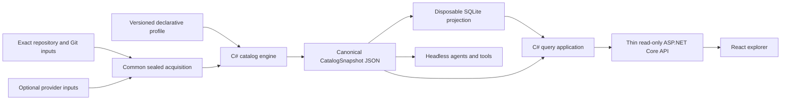

# Repository Knowledge Catalog Architecture

| Field | Value |
| --- | --- |
| Status | Proposed records-only architecture; implementation not authorized |
| Decision | [DEC-0039](../../decisions/DEC-0039-repository-knowledge-catalog-and-react-explorer.md) |
| Owning feature | [FEAT-0071](../../features/FEAT-0071-repository-knowledge-catalog/README.md) |
| Tracking | [Issue #182](https://github.com/hasanmanzak/meAndAI/issues/182) |
| UI constraint | React; no Razor Pages, Blazor, MVC views, or server-rendered HTML |
| Persistence constraint | SQLite is a rebuildable projection, never source authority |

## 1. Purpose

This architecture defines a common, repository-agnostic knowledge catalog that
can be invoked against meAndAI or any adopting consumer. It records a future
contract and delivery boundary. It contains no implementation authority and
does not claim that an application, database, API, UI, test, package, workflow,
or consumer integration exists.

The catalog is useful in three contexts:

- **Generic repository:** navigate files, supported documents, locations, Git
  identity, and conservative explicit links.
- **meAndAI-aware repository:** add semantic identities and relations for
  protocol/governance/SDLC records.
- **Consumer repository:** add project-specific semantics through a closed,
  declarative discovery profile while reusing the common engine and UI.

## 2. Authority model

The name "catalog" does not grant authority. Five layers remain distinct:

| Layer | Authority | Catalog behavior |
| --- | --- | --- |
| Repository files, Git objects, and supported documents | Canonical source for their own content and identity | Read exact acquired content; retain source locations and acquisition state. |
| Provider objects | Canonical provider source within the sealed acquisition envelope | Preserve exact identity, provenance, freshness, and completeness state. |
| `CatalogSnapshot` | Canonical catalog output for one exact input/profile/contract tuple | Deterministic typed knowledge graph and diagnostics. |
| SQLite | Disposable query projection | Rebuild from a compatible snapshot; never supply or override source facts. |
| React | Presentation projection | Render/query facts; never discover, infer, acquire, or decide authority. |

The **Repository Knowledge Catalog** is a navigation graph. The governance
**Rule Catalog** in
[FEAT-0065](../../features/FEAT-0065-shared-executable-conformance-runtime/README.md)
owns rule specifications, applicability, evaluation, findings, verdicts, and
enforcement. A knowledge entity may point to the source location of a rule but
cannot execute, qualify, waive, or reinterpret it.

## 3. System boundary

Dependency direction is inward:

1. typed catalog domain contracts;
2. discovery/canonicalization/query application use cases;
3. repository-input, Markdown, common acquisition-envelope, SQLite, and
   serialization adapters;
4. thin headless/query/HTTP hosts;
5. React presentation.

The engine is independently usable without SQLite, ASP.NET Core, or React.
SQLite is independently rebuildable from the canonical snapshot. React sees
only the versioned query API.

## 4. Discovery inputs and levels

### 4.1 Declared input envelope

Every run declares, at minimum:

- catalog contract version;
- exact repository identity and acquired root/ref/object identities;
- candidate/exact authority state for each source;
- discovery profile identifier, version, and digest;
- requested supported document families and resource bounds;
- optional sealed provider acquisition envelope identities; and
- canonicalization policy version.

Ambient current directory, wall-clock time, machine-specific absolute paths,
environment-dependent locale, provider page order, and SQLite state cannot
silently change catalog identity.

### 4.2 Generic discovery

Generic mode requires no meAndAI file. It may discover:

- safe relative files and directories;
- supported Markdown documents, headings, explicit local/absolute links, and
  code/source locations where a parser contract exists;
- exact Git repository/ref/tree/blob/commit identity supplied by acquisition;
- conservative language/file-family metadata that does not claim domain
  semantics; and
- diagnostics for malformed, unsupported, unsafe, binary, oversized, duplicate,
  or ambiguous input.

Generic mode does not infer issue identity from arbitrary bare issue shorthand, infer a
feature from a filename that merely resembles one, or follow filesystem links
outside the acquired root.

### 4.3 meAndAI semantic discovery

The meAndAI profile may recognize explicit, supported structures for:

- `EPIC-NNNN`, `TASK-NNNN`, `IDEA-NNNN`, `FEAT-NNNN`, `SUBF-NNNN`,
  `BUG-NNNN`, `FIND-NNNN`, `DEC-NNNN`, `TEST-NNNN`, and `RISK-NNNN`;
- canonical feature, decision, idea, memory, architecture, and protocol records;
- issue, pull-request, immutable commit/blob, section-anchor, and related links;
  and
- explicitly rendered parent, dependency, owner, evidence, and delivery
  relationships.

Recognition does not confer lifecycle validity. For example, finding a
`TEST-NNNN` location does not mean it is active, passing, distinct, or complete.
Those are governance/runtime concerns outside this catalog.

### 4.4 Consumer profiles

A consumer profile is data, not code. The first version may declare only a
closed set of operations such as:

- include/exclude path families under the acquired root;
- map a supported document/filename pattern to a namespaced entity kind;
- select identity fields or supported capture groups with explicit validation;
- map supported explicit links/fields to named relation kinds;
- attach bounded labels/facets; and
- select parser/capability versions already shipped by the protocol.

Profiles cannot contain scripts, regular-expression features without bounded
evaluation, arbitrary expressions, dynamic assemblies, network calls, file
writes, provider queries, or overrides of common entity/relation semantics.
Whether bounded regular expressions are admitted at all is a Gate 2 question.

## 5. Proposed contract model

The names below establish review vocabulary, not final API signatures.

### 5.1 `CatalogSnapshot`

Required fields:

- `contractVersion` and `canonicalizationVersion`;
- `snapshotId`, derived from a canonical payload that excludes the derived ID
  itself and any operational envelope metadata;
- `repositoryIdentity` and exact/candidate source authority;
- `profileIdentity` with name, version, and digest;
- sorted acquisition manifest references;
- sorted entities, relations, locations, and diagnostics;
- source/result counts and truncation/resource-limit indicators; and
- compatibility metadata sufficient to reject unsupported consumers.

Wall-clock metadata such as `generatedAt` is excluded from `CatalogSnapshot`
canonical JSON. If operational telemetry needs it, a distinct non-canonical
transport/run envelope may carry it and must not affect snapshot identity.

### 5.2 `CatalogEntity`

Required review fields:

- stable `entityId` in a contract-owned namespace;
- closed/versioned `kind` plus optional profile namespace;
- source-declared identifier when one exists;
- title/display label as non-authoritative presentation data;
- one or more location references;
- discovery method and confidence class;
- acquisition/provenance reference;
- optional lifecycle/status facts with their exact source and no invented
  normalization; and
- content/source identity needed to distinguish revisions.

An entity ID must not depend on database row order, traversal order, UI label,
wall-clock time, or machine path. The Gate 2 contract must decide collision and
rename behavior for source-declared IDs versus content/location-derived IDs.

### 5.3 `CatalogRelation`

Required review fields:

- stable `relationId`;
- source and target entity IDs, or an explicit unresolved target descriptor;
- closed/versioned relation kind;
- method: `Explicit`, `Inferred`, or `Unresolved`;
- direction and multiplicity semantics;
- source location/provenance and acquisition state; and
- confidence/reason code for non-explicit relations.

Candidate relation kinds include `Contains`, `Defines`, `References`,
`DependsOn`, `Decides`, `Tests`, `Mitigates`, `Tracks`, `Implements`,
`Supersedes`, `RelatesTo`, and `LocatedAt`. Gate 2 must close the initial set and
direction rules. Free-text similarity is not an `Explicit` relation.

### 5.4 `CatalogLocation`

A location is typed rather than stored as one opaque URL. Required review
fields include repository identity, ref/object identity, safe relative path,
optional line/column/section anchor, provider/object identity, URI type,
display/navigation URI, and acquisition/provenance reference.

Exact immutable Git/blob links, mutable branch links, local candidate paths,
and provider web/API identities remain distinguishable. A display URL does not
replace the typed identity.

### 5.5 Acquisition and provenance

Catalog facts reference an acquisition record instead of flattening
completeness into booleans. At minimum the model preserves:

- exact/candidate authority;
- source kind and exact identity;
- `Complete`, `Partial`, `Stale`, `RateLimited`, `Unsupported`,
  `NonConvergent`, `Redacted`, or `Failed` state where applicable;
- requested/covered surfaces and bounded omissions;
- input digest/receipt and common
  [FEAT-0067](../../features/FEAT-0067-evidence-acquisition-managed-consumer-integration/README.md)
  contract version; and
- diagnostic references.

The exact state vocabulary must be reused from, or losslessly mapped to, the
accepted [FEAT-0067](../../features/FEAT-0067-evidence-acquisition-managed-consumer-integration/README.md)
contract. This architecture does not pre-empt that feature's final API.

### 5.6 Diagnostics

Diagnostics are data and remain separate from entities/relations. Each has a
stable code, severity/class, source location, acquisition reference, bounded
message parameters, and optional related entity/relation. Diagnostics cover
malformed input, duplicate/collision, ambiguity, unsupported version/kind,
unsafe path/link, redaction, resource bound, projection mismatch, and partial
acquisition. They are not governance findings or conformance verdicts.

## 6. Determinism and compatibility

Canonical snapshot JSON must define:

- UTF-8 encoding and Unicode normalization policy;
- property and collection ordering;
- path separator/case policy based on source semantics rather than host
  accident;
- numeric, boolean, null/omitted, and string escaping rules;
- duplicate fact/relation normalization;
- identity-bearing versus operational metadata;
- digest algorithm and snapshot ID construction;
- contract/profile/canonicalization version behavior; and
- unsupported/additive compatibility behavior.

The same declared inputs must produce byte-identical JSON across supported
Windows and Linux hosts. A different exact source identity, profile digest,
semantically relevant acquisition envelope, or contract version must change
snapshot identity. Unsupported versions fail explicitly; they are not silently
upgraded in place.

The canonical payload excludes the derived snapshot ID. Canonicalization first
normalizes identity-bearing facts, deterministic diagnostics, path semantics,
and redaction results; it then hashes that payload and emits the complete
snapshot with the derived ID. The exact two-phase schema remains a Gate 2 item,
but self-referential digest construction is forbidden.

## 7. SQLite projection and query boundary

SQLite is selected for local portability and simple indexed query. The first
projection is expected to hold snapshot metadata, entities, relations,
locations, acquisition records, diagnostics, normalized facets, and a full-text
search index where supported.

Binding invariants:

- one database declares the exact snapshot ID and projection schema version;
- projection is a transactionally replaced materialization, not an incremental
  source of new facts;
- a database may be deleted at any time and rebuilt from canonical JSON;
- stale, corrupt, partial, foreign, or schema-incompatible projection state is
  rejected or safely rebuilt, never merged as authority;
- queries have stable ordering, explicit pagination/cursors, maximum result and
  traversal depth, cancellation, and resource bounds;
- query responses return snapshot/projection identity and any relevant
  acquisition/diagnostic state; and
- FTS capability, tokenizer, ranking, Unicode behavior, and a deterministic
  fallback must be frozen before [SUBF-0167](../../features/FEAT-0071-repository-knowledge-catalog/README.md#subf-0167)
  reaches Gate 3.

Migrations preserve projection compatibility only. Historical canonical
snapshots remain governed by their snapshot contract, not rewritten database
rows.

## 8. Headless and HTTP query contracts

The application layer should support headless operations before HTTP exists:

- build one snapshot from sealed inputs;
- serialize/validate canonical JSON;
- project/rebuild SQLite;
- retrieve entity/location/provenance/diagnostic detail;
- search/filter/sort/page entities;
- traverse bounded incoming/outgoing relations; and
- report snapshot/acquisition/projection health.

A thin ASP.NET Core host may expose equivalent versioned read-only endpoints,
for example catalog metadata/health, entity collection/detail, relation
neighborhood, diagnostics, and search. Exact routes and DTOs remain Gate 2
work. The host should prefer a small Minimal API surface unless contract review
shows controller features are materially required.

No endpoint triggers repository/provider mutation, governance evaluation,
publication, release action, dynamic profile execution, arbitrary SQL, or
unbounded graph traversal. Discovery/rebuild operations require an explicit
local invocation boundary and are not implicitly exposed as unauthenticated
remote web actions.

The default host binding is loopback-only. Non-loopback use requires an
explicitly reviewed authenticated and TLS-protected deployment profile. Gate 2
must freeze same-origin/CORS, CSP, anti-injection/output-encoding, cache/private
content, and safe source-link scheme policies before HTTP implementation.

## 9. React explorer

The React client is a projection over the HTTP query contract. Initial product
surfaces are expected to include:

- repository/snapshot identity and acquisition health;
- search with kind/status/profile facets;
- entity list and detail;
- incoming/outgoing relationship navigation;
- exact source/provenance locations and safe links;
- diagnostics, ambiguity, and partial/stale evidence indicators; and
- empty, loading, error, incompatible, and offline/static-asset states.

The UI must preserve the distinction between explicit, inferred, and unresolved
relations and between absent, unknown, partial, stale, and failed evidence. It
must not display inferred status as source-declared status or catalog
diagnostics as governance findings.

Accessibility, keyboard navigation, responsive layout, browser support,
maximum response/render sizes, large-result behavior, and performance budgets
must be closed before implementation. Exact React tooling and visual design are
not selected by this record.

## 10. GitHub/provider enrichment

GitHub enrichment is optional and depends on
[FEAT-0067](../../features/FEAT-0067-evidence-acquisition-managed-consumer-integration/README.md).
The catalog receives typed/sealed objects or envelopes; it does not perform its
own event validation, pagination, retry, rate-limit, credential, redaction,
convergence, or completeness logic.

Candidate catalog entities include issues, pull requests, reviews, review
threads/comments, conversation comments, commit comments, commits, checks,
workflow runs, releases, labels, and ruleset references only when
[FEAT-0067](../../features/FEAT-0067-evidence-acquisition-managed-consumer-integration/README.md)
supports and identifies those surfaces. Provider relations require exact
repository/object identity, not number-only or URL-text guesses.

Negative knowledge is scoped. A provider object may be reported absent only
when the sealed envelope proves completeness for the exact provider,
repository, ref/object scope, surface, filters/query, and observation window
that would contain it. A known returned entity can be exact while the requested
inventory remains partial; partial/unsupported scopes cannot prove absence.

## 11. Security and operational bounds

Threats to close before Gate 3 include:

- path traversal, symlink/reparse escape, unsafe external links, and device or
  special files;
- repository scripts/hooks/configuration treated as executable behavior;
- binary, invalid-encoding, decompression, parser-complexity, and oversized
  content attacks;
- secret/token/private-content exposure in snapshot, SQLite, logs, API, or UI;
- entity/relation explosions and unbounded graph/FTS queries;
- malicious Markdown/HTML/URL rendering and client-side injection;
- SQLite corruption, tampering, locking, and foreign-schema confusion;
- stale/partial/provider failure presented as authoritative absence; and
- query-host exposure beyond a local or explicitly authenticated boundary.

Required defenses include no content execution, safe-root resolution, parser
and resource bounds, content/diagnostic redaction, output encoding and link
allowlists, query limits/cancellation, immutable input and snapshot identity,
read-only host authority, and explicit unsupported/failure states.

## 12. Distribution and consumer experience

The intended consumer flow is:

1. adopt or update to an immutable meAndAI release through
   [FEAT-0061](../../features/FEAT-0061-consumer-adoption-cli/README.md) or
   [FEAT-0062](../../features/FEAT-0062-consumer-protocol-update-cli/README.md),
   with release finalization remaining under
   [FEAT-0068](../../features/FEAT-0068-protocol-release-finalizer-authority-transfer/README.md);
2. optionally enable the released catalog capability;
3. supply the repository target and an optional declarative consumer profile;
4. produce/validate a canonical snapshot in a read-only operation;
5. optionally build SQLite and start the local read-only query host/React
   explorer; and
6. discard/rebuild projections at any time without losing authority.

Consumers own project-specific profile configuration and domain evidence. They
do not copy shared discovery, parser, canonicalization, projection, API, React,
fixtures, or tests. A reusable correction is made and proven in meAndAI first,
published immutably, then adopted separately by the consumer.

## 13. Delivery slices and gates

The feature is decomposed into:

- [SUBF-0165](../../features/FEAT-0071-repository-knowledge-catalog/README.md#subf-0165):
  domain/snapshot contracts and generic headless discovery;
- [SUBF-0166](../../features/FEAT-0071-repository-knowledge-catalog/README.md#subf-0166):
  meAndAI semantic discovery and declarative consumer profiles;
- [SUBF-0167](../../features/FEAT-0071-repository-knowledge-catalog/README.md#subf-0167):
  canonical JSON, SQLite projection, and bounded query;
- [SUBF-0168](../../features/FEAT-0071-repository-knowledge-catalog/README.md#subf-0168):
  thin ASP.NET Core API and React explorer; and
- [SUBF-0169](../../features/FEAT-0071-repository-knowledge-catalog/README.md#subf-0169):
  common provider enrichment and immutable consumer distribution.

Each slice must pass planning, design, implementation, review, testing, and
delivery gates independently. A later slice cannot be used as evidence that an
earlier headless/domain contract is correct. Provider enrichment cannot begin
until its
[FEAT-0067](../../features/FEAT-0067-evidence-acquisition-managed-consumer-integration/README.md)
dependency is accepted and available.

## 14. Open Gate 2 questions

- What exact entity, relation, diagnostic, acquisition, and location
  vocabularies make the first compatible contract?
- How are stable IDs derived across file moves, declared-ID collisions,
  provider identities, and content revisions?
- Which Markdown constructs/parsers and repository file families are supported
  initially, and what are their exact resource bounds?
- Does the first profile schema admit bounded regular expressions, or only
  named shipped matchers?
- What canonical JSON schema, digest, nullability, ordering, and version
  negotiation rules apply?
- Which SQLite schema, FTS tokenizer/fallback, migration, concurrency, and
  rebuild policies are portable across supported targets?
- Which API pagination/cursor/error semantics and local access/authentication
  boundary are required?
- Which React tooling, browser/accessibility/performance budgets, and source-link
  safety policy are selected?
- What is the exact delivery and compatibility relationship with active
  [FEAT-0065](../../features/FEAT-0065-shared-executable-conformance-runtime/README.md),
  [FEAT-0067](../../features/FEAT-0067-evidence-acquisition-managed-consumer-integration/README.md),
  and the records merged by [PR #181](https://github.com/hasanmanzak/meAndAI/pull/181)?
- What fixed profile merge order, namespace rules, and collision behavior allow
  generic facts, then meAndAI additions, then consumer additions without any
  later layer overriding an earlier fact?

No application work begins until the selected slice closes its applicable
questions and receives a separate implementation directive.
